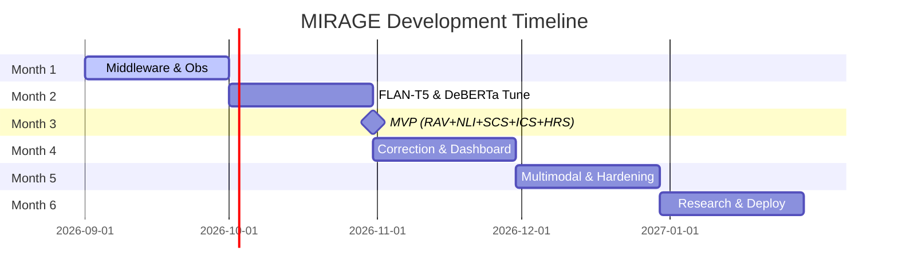

# MIRAGE — Product Requirements Document (PRD)
**An Autonomous Multimodal Hallucination Detection and Factual Consistency Verification System for Production LLMs**

---

| Field | Details |
|---|---|
| Document Version | 2.1.0 |
| Status | Approved |
| Authors | 23AIML042 Vedant, 23AIML076 Dax |
| Institution | IIIT Bangalore — CTRI-DG |
| Date | September 2026 |
| Review Cycle | Monthly |

---

## Table of Contents

1. Executive Summary
2. Problem Statement
3. Product Vision
4. Stakeholders
5. User Personas
6. Product Scope
7. Functional Requirements
8. Non-Functional Requirements
9. System Constraints
10. Assumptions and Dependencies
11. Risk Register
12. Milestones and Timeline
13. API Versioning Strategy
14. Data Model Summary
15. Success Metrics
16. Out of Scope
17. Glossary
18. Document Changelog

---

## 1. Executive Summary

Large Language Models (LLMs) are being deployed at scale across enterprise environments for tasks ranging from customer support to medical documentation to financial analysis. However, LLMs hallucinate — they produce confident, fluent, and convincingly formatted responses that are factually incorrect, unsupported, or internally inconsistent. As of 2026, no production-grade middleware exists that intercepts LLM responses in real time, verifies them across multiple independent signals, and returns a calibrated risk score before the response reaches the end user.

MIRAGE fills this gap. It is a black-box middleware system — requiring zero changes to the underlying LLM or the application consuming it — that runs a parallel multi-signal verification pipeline combining five distinct evidentiary signals: Retrieval-Augmented Verification (RAV), Self-Consistency Sampling (SCS) with Semantic Entropy clustering across n=5 samples, Natural Language Inference (NLI) multi-evidence entailment checking, LLaVA-primary visual grounding with adaptive CLIP pre-filtering, and an intra-response Internal Consistency Scorer (ICS) to detect self-contradictory reasoning. Claim decomposition is handled by a fine-tuned FLAN-T5-base model running at sub-50ms CPU latency, tagging atomic claims with domain criticality weights.

Every response receives a calibrated Hallucination Risk Score (HRS) produced by a non-linear LightGBM meta-learner, calibrated via Isotonic Regression (guaranteeing ECE < 0.05), and bounded by Mondrian (group-conditional) Conformal Prediction intervals ensuring statistical coverage guarantees across risk tiers and claim types. Exact TreeSHAP feature attributions explain each claim's risk contribution. Flagged responses are autonomously rewritten by an evidence-grounded agentic correction loop before delivery. A longitudinal drift dashboard tracks model reliability over time, rigorously benchmarked across TruthfulQA, HaluEval, MMHAL-Bench, FActScoring, and cross-evaluated across diverse LLM families (Llama 3.1, Mixtral, Gemma 2).

MIRAGE targets enterprise teams and AI researchers deploying LLMs in production who need trustworthy, auditable, explainable, and provably reliable AI outputs at zero compute-infrastructure cost.

---

## 2. Problem Statement

### 2.1 The Core Problem

LLMs hallucinate. This is not a fringe failure mode — studies on GPT-4, Claude, and Gemini class models show hallucination rates between 3% and 27% depending on domain and query type. In high-stakes enterprise contexts, even a 3% hallucination rate translates to thousands of incorrect outputs per day at scale.

### 2.2 Why Existing Solutions Fail

| Existing Approach | Limitation |
|---|---|
| FACTSCORE | Text-only, offline evaluation, not real-time middleware |
| SelfCheckGPT | High latency due to multiple full LLM passes, no multimodal support, no calibrated score |
| Cross-model consistency (naive) | Correlated error problem — two LLMs trained on same web data agree on the same false facts |
| Retrieval-only grounding | Single signal, no calibration, no visual claim verification |
| LLM provider confidence scores | Requires logprob access, not available via standard black-box APIs |
| Human review | Not scalable, retrospective, expensive |
| LLM-based claim decomposition | Full LLM API call per response adds cost and latency at scale; a fine-tuned small model is faster and cheaper |

### 2.3 Business Impact of Hallucination

- Customer support chatbots providing wrong policy information → legal liability
- Medical documentation assistants stating incorrect drug interactions → patient safety risk
- Financial analysis agents citing non-existent data → regulatory and fiduciary risk
- Legal contract review tools missing or fabricating clauses → contract disputes

### 2.4 The Gap MIRAGE Fills

No existing system combines multiple independent verification signals into a single calibrated score, operates as black-box middleware at production latency, handles both text and multimodal outputs, tracks hallucination drift over time, and autonomously corrects flagged responses. MIRAGE addresses all five gaps simultaneously.

---

## 3. Product Vision

MIRAGE becomes the universal trust layer for enterprise LLM deployments — a plug-and-play middleware that any organization can deploy in front of any LLM API in under one hour, giving them real-time hallucination detection, calibrated risk scoring, autonomous correction, and longitudinal reliability monitoring with zero changes to their existing application stack.

**Vision Statement:**
*Every LLM response that reaches an enterprise user should be verified, scored, and auditable — MIRAGE makes that the default, not the exception.*

---

## 4. Stakeholders

| Stakeholder | Role | Interest |
|---|---|---|
| Enterprise AI/ML Teams | Primary users | Deploy MIRAGE in front of their LLM APIs |
| Compliance and Risk Officers | Secondary users | Use audit reports and HRS dashboards for regulatory evidence |
| End Users of LLM Applications | Indirect beneficiaries | Receive more reliable LLM outputs |
| LLM API Providers | External dependency | Groq (free tier), OpenRouter (free models), Hugging Face Inference API (free tier) for development; enterprise tenants may configure OpenAI, Anthropic, or any OpenAI-compatible provider |
| Academic Reviewers | Evaluators | Assess research novelty of HRS calibration methodology |
| IIITB Faculty | Project evaluators | Assess technical depth, innovation, and production readiness |

---

## 5. User Personas

### Persona 1 — Arjun, ML Engineer at a FinTech Startup
Arjun's team has deployed GPT-4o for automated financial report summarization. Last quarter, the model hallucinated a revenue figure in a client report. Arjun needs a middleware layer he can drop in front of the OpenAI API that flags financially inconsistent outputs before they reach the client dashboard. He wants a simple REST API integration, a dashboard to monitor HRS trends, and PDF audit reports he can share with compliance.

### Persona 2 — Dr. Priya, Clinical Informatics Lead at a Hospital Network
Dr. Priya's hospital uses an LLM assistant for nursing documentation and shift handovers. She is deeply concerned about the model fabricating medication names or dosages. She needs a system that verifies every output against their hospital's medical knowledge base, flags visual inconsistencies in multimodal reports, and maintains a tamper-proof audit trail for each patient record interaction.

### Persona 3 — Rohan, DevOps Lead at an Enterprise SaaS Company
Rohan's company offers an LLM-powered internal knowledge assistant to 5,000 employees. He needs MIRAGE to scale horizontally under concurrent load, integrate with their existing Prometheus/Grafana observability stack, and provide real-time alerts when hallucination rates spike above a configured threshold.

---

## 6. Product Scope

### 6.1 In Scope

- Real-time LLM response interception middleware (REST + WebSocket) supporting OpenAI-compatible and Anthropic formats
- Fine-tuned FLAN-T5-base model for sub-50ms CPU claim decomposition with automated claim criticality categorization (High, Medium, Low)
- Five-signal parallel verification pipeline:
  1. Retrieval-Augmented Verification (RAV) via Qdrant vector retrieval
  2. Self-Consistency Sampling (SCS) with n=5 temperature samples and Semantic Entropy clustering
  3. Natural Language Inference (NLI) multi-evidence entailment checking via fine-tuned DeBERTa-v3-large
  4. Visual Grounding Score (VGS) using LLaVA-1.6 with adaptive CLIP pre-filtering
  5. Internal Consistency Scorer (ICS) executing intra-response pairwise NLI to flag self-contradictions
- Hallucination Risk Score (HRS) Engine powered by a non-linear LightGBM meta-learner
- Rigorous post-hoc calibration via Isotonic Regression (benchmarked against Platt and Temperature scaling) ensuring ECE < 0.05
- Mondrian (group-conditional) Conformal Prediction providing statistical coverage guarantees across risk tiers and claim types
- TreeSHAP feature attribution per claim (`signal_attribution`) for complete audit explainability
- Agentic correction loop for autonomous response rewriting with mandatory re-verification pass (LangGraph)
- Longitudinal HRS drift dashboard (React frontend) with multi-model tracking
- Audit trail storage and exportable compliance reports (PostgreSQL + MongoDB)
- Operator alert system with configurable HRS thresholds
- Multi-tenant support with per-tenant configuration (pydantic-settings)
- RabbitMQ as Celery broker for durable task queuing (Redis retained for caching and rate limiting)
- Benchmarking across TruthfulQA, HaluEval, MMHAL-Bench, FActScoring, and cross-model evaluation (Llama 3.1, Mixtral, Gemma 2)
- Zero-cost development deployment profile (Groq/OpenRouter/Hugging Face APIs + local Docker Compose + College GPU)
- Docker-based deployment with enterprise cloud profiles (AWS G5.2xlarge A10G)
- Advanced Observability: OpenTelemetry, Grafana Tempo for distributed tracing, Prometheus/Grafana, structlog for JSON logging
- pybreaker for circuit breakers per external dependency and graceful degradation modes
- LLaVA served via TGI (text-generation-inference); DeBERTa served via TorchServe

### 6.2 Out of Scope (Version 1.0)

- Audio/speech modality verification
- Federated multi-enterprise deployment
- Mobile application interface
- Support for locally hosted open-source LLMs (Ollama, LM Studio) — planned for v2.0
- Multilingual hallucination detection beyond English — planned for v2.0
- Real-time model fine-tuning based on correction feedback

---

## 7. Functional Requirements

### 7.1 Gateway Layer (GW)

| ID | Requirement | Acceptance Criteria | Priority |
|---|---|---|---|
| FR-GW-01 | System shall intercept any LLM API request/response pair via a configurable proxy endpoint | Verified when a standard OpenAI-compatible Chat Completions request (e.g., Groq) is proxied with <50ms gateway overhead measured by integration test | P0 |
| FR-GW-02 | System shall support OpenAI-compatible API format (used by Groq, OpenRouter, HuggingFace TGI) and Anthropic Messages API format | Verified when standard Groq, OpenRouter, and Anthropic curl requests return properly proxied successful HTTP 200 responses | P0 |
| FR-GW-03 | System shall pass the original prompt and response as context to all verification modules | Verified when downstream modules receive exact matched string structures from incoming proxy payload in log outputs | P0 |
| FR-GW-04 | System shall return verified response (or corrected response) to the calling application with HRS metadata appended | Verified when API caller receives original schema plus a populated `mirage_metadata` block including HRS and CI | P0 |
| FR-GW-05 | System shall support streaming responses via WebSocket with incremental verification | Verified when WebSocket client receives chunked tokens while verification is executed asynchronously | P1 |

### 7.2 Retrieval-Augmented Verification (RAV) Module

| ID | Requirement | Acceptance Criteria | Priority |
|---|---|---|---|
| FR-RAV-01 | System shall decompose LLM responses into atomic factual claims and assign domain criticality weights (`high`, `medium`, `low`) | Verified when FLAN-T5-base extracts single-fact claims with schema-compliant criticality tags within 50ms | P0 |
| FR-RAV-02 | System shall retrieve top-k (default k=5) relevant documents from a configured vector knowledge base per claim | Verified when Qdrant vector similarity search returns k documents for at least 95% of test claims | P0 |
| FR-RAV-03 | System shall compute a retrieval support score per claim indicating evidence strength | Verified when support score correlates positively with manual relevancy grades | P0 |
| FR-RAV-04 | System shall support both static knowledge base (Qdrant) and live web retrieval as sources | Verified by successful document fetch from both local Qdrant and external web search mock | P1 |
| FR-RAV-05 | System shall surface retrieved evidence snippets as explainability output per flagged claim | Verified when audit response payload contains `evidence_snippets` array for each claim evaluated | P0 |

### 7.3 Self-Consistency Sampling (SCS) Module

| ID | Requirement | Acceptance Criteria | Priority |
|---|---|---|---|
| FR-SCS-01 | System shall query the primary LLM n=5 times per verification request with temperature=0.7 | Verified by confirming 5 asynchronous API calls to the LLM backend with varying sample completions | P0 |
| FR-SCS-02 | System shall cluster decomposed claims across the 5 samples into discrete semantic equivalence classes | Verified when bidirectional entailment clustering groups paraphrased claims together with >95% accuracy | P0 |
| FR-SCS-03 | System shall compute a Semantic Entropy score $SE(x) = -\sum_c p(c) \log p(c)$ across semantic clusters | Verified when high semantic divergence yields high normalized SCS risk score in [0.0, 1.0] | P0 |
| FR-SCS-04 | System shall cache SCS samples and cluster states in Redis with TTL=1 hour keyed on prompt hash | Verified when a repeated identical prompt executes with 0 extra LLM calls via cache hit | P0 |
| FR-SCS-05 | System shall support configurable SCS sample count (n=5 default, adjustable) and tenant-level disable switch | Verified when disabling SCS bypasses sampling and triggers automatic HRS weight renormalization | P1 |

### 7.4 NLI Entailment Scorer

| ID | Requirement | Acceptance Criteria | Priority |
|---|---|---|---|
| FR-NLI-01 | System shall run fine-tuned DeBERTa-v3-large verifier model on each (evidence, claim) pair via TorchServe | Verified when DeBERTa inference on TorchServe returns under 200ms for a batch of 10 pairs | P0 |
| FR-NLI-02 | System shall classify each pair into 3-class distribution: Entailed, Neutral, Contradicted | Verified by inference outputs strictly adhering to valid 3-class probability distribution summing to 1.0 | P0 |
| FR-NLI-03 | System shall execute multi-evidence aggregation: $p_{\text{contra}} = \max_i P(\text{Contradiction} \mid e_i, c)$, $p_{\text{support}} = \max_i P(\text{Entailment} \mid e_i, c)$ | Verified when contradictory evidence across any retrieved chunk correctly drives the claim risk score | P0 |
| FR-NLI-04 | System shall batch process multiple claims and evidence pairs per response for inference efficiency | Verified when claims are dispatched to TorchServe in lists rather than individual requests | P0 |

### 7.5 Visual Grounding Module (VG)

| ID | Requirement | Acceptance Criteria | Priority |
|---|---|---|---|
| FR-VG-01 | System shall accept multimodal LLM responses containing image references or base64-encoded image data | Verified when API payload safely parses and routes base64 encoded strings to vision sub-modules | P0 |
| FR-VG-02 | System shall run CLIP as a pre-filter: claims with tunable similarity > threshold (default 0.85) are marked consistent | Verified when valid image/caption pairs bypass LLaVA execution completely based on tenant threshold validated on MMHAL-Bench | P0 |
| FR-VG-03 | System shall run LLaVA-1.6 via TGI with a targeted VQA prompt for all claims below the CLIP threshold | Verified when TGI backend processes the prompt and image and returns detailed verification text | P0 |
| FR-VG-04 | System shall produce a Visual Grounding Score (VGS) in [0,1] per image-grounded claim | Verified when TGI response is parsed into a numeric VGS value representing consistency | P0 |
| FR-VG-05 | System shall annotate and return flagged image regions as visual evidence frames in audit report | Verified when audit metadata contains bounding box or highlighted region metadata | P1 |

### 7.6 Internal Consistency Scorer (ICS) Module

| ID | Requirement | Acceptance Criteria | Priority |
|---|---|---|---|
| FR-ICS-01 | System shall execute pairwise NLI checking across all atomic claims extracted within the single LLM response | Verified when all $O(K^2)$ claim pairs are evaluated for mutual contradiction via DeBERTa verifier | P0 |
| FR-ICS-02 | System shall compute an Internal Consistency Score (ICS) in [0.0, 1.0] penalizing logical, chronological, or numerical contradictions | Verified when intra-response conflicting facts (e.g., birth/death date arithmetic conflict) yield ICS > 0.7 | P0 |
| FR-ICS-03 | System shall identify and flag mutually contradictory claim pairs in the audit and explainability payload | Verified when response metadata explicitly highlights the conflicting claim IDs and contradiction probabilities | P0 |

### 7.7 Hallucination Risk Score (HRS) Engine

| ID | Requirement | Acceptance Criteria | Priority |
|---|---|---|---|
| FR-HRS-01 | System shall aggregate the 5 evidentiary signals (RAV, SCS/Semantic Entropy, NLI, VGS, ICS) and claim metadata using a trained LightGBM GBDT meta-learner | Verified when non-linear feature interactions are captured and raw risk score is generated in <25ms | P0 |
| FR-HRS-02 | System shall compute a criticality-weighted response-level HRS point estimate in [0.0, 1.0] weighting high-criticality claims proportionally | Verified when high-criticality claims carry 3.3x more weight than low-criticality claims in aggregate score | P0 |
| FR-HRS-03 | System shall apply Mondrian (group-conditional) Conformal Prediction to output statistically valid confidence intervals | Verified when empirical coverage $\ge 94\%$ is maintained conditionally across every risk tier and claim type | P0 |
| FR-HRS-04 | System shall categorize HRS into four actionable risk tiers: Low (0.0–0.3), Medium (0.3–0.6), High (0.6–0.8), Critical (0.8–1.0) | Verified when categorical `risk_tier` matches the calibrated numeric HRS mapping | P0 |
| FR-HRS-05 | System shall calibrate HRS via Isotonic Regression (benchmarked against Platt and Temperature scaling) achieving ECE < 0.05 | Verified when evaluation across TruthfulQA, HaluEval, and FActScoring yields ECE < 0.05 post-calibration | P0 |
| FR-HRS-06 | System shall compute TreeSHAP feature attributions (`signal_attribution`) quantifying percentage contribution of each signal per claim | Verified when SHAP values sum to the model prediction shift and provide explainability per claim | P0 |

### 7.8 Agentic Correction Loop (COR)

| ID | Requirement | Acceptance Criteria | Priority |
|---|---|---|---|
| FR-COR-01 | System shall automatically trigger correction for responses with HRS above configurable threshold | Verified when a response scoring 0.85 (Critical) automatically enters the correction loop via LangGraph | P0 |
| FR-COR-02 | System shall rewrite flagged claims using the same LLM with strict evidence-grounded prompting | Verified by trace logs showing correction prompt explicitly passing RAV evidence to the primary LLM | P0 |
| FR-COR-03 | System shall perform a mandatory re-verification pass on the corrected output | Verified when rewritten output triggers a secondary HRS calculation cycle before returning | P0 |
| FR-COR-04 | System shall attach correction metadata (which claims were rewritten, evidence used) to audit log | Verified when audit payload shows original text struck through alongside the corrected replacement text | P0 |
| FR-COR-05 | System shall return corrected response to calling application within overall latency SLA | Verified when total time (including original proxy, verification, and correction) respects configured timeouts | P0 |

### 7.9 Longitudinal Drift Dashboard (DFT)

| ID | Requirement | Acceptance Criteria | Priority |
|---|---|---|---|
| FR-DFT-01 | System shall store HRS per response with timestamp, model ID, tenant ID, and category | Verified by querying PostgreSQL audit tables and validating correct column insertion | P0 |
| FR-DFT-02 | System shall render time-series HRS trend per model and per tenant on dashboard | Verified when React frontend successfully displays line charts over a 30-day window | P0 |
| FR-DFT-03 | System shall display hallucination category breakdown (factual, visual, consistency) | Verified when pie chart component loads accurate percentage splits of hallucination types | P0 |
| FR-DFT-04 | System shall alert operators when 7-day rolling average HRS exceeds configured threshold | Verified when simulated database manipulation triggers an email/webhook alert via the worker | P0 |
| FR-DFT-05 | System shall support drill-down from dashboard trend to individual flagged responses | Verified when clicking a chart data point opens the corresponding raw response trace | P1 |

### 7.10 Audit and Reporting (AUD)

| ID | Requirement | Acceptance Criteria | Priority |
|---|---|---|---|
| FR-AUD-01 | System shall store full verification trace per response: prompt, response, HRS, SHAP attribution, per-signal scores, evidence, correction | Verified by complete trace payload serialization into PostgreSQL JSONB and MongoDB | P0 |
| FR-AUD-02 | System shall generate exportable PDF compliance report per session, per model, and per time period | Verified when a valid, well-formatted PDF file is generated and downloaded via the API | P0 |
| FR-AUD-03 | System shall support audit log query via natural language operator interface | Verified when a natural query returns the correct filtered log subset | P1 |
| FR-AUD-04 | System shall retain audit data for configurable retention window (default 90 days) | Verified when nightly cron job successfully prunes records older than 90 days | P0 |

---

## 8. Non-Functional Requirements

| ID | Requirement | Target |
|---|---|---|
| NFR-01 | End-to-end verification latency (P95) | < 3 seconds per response |
| NFR-02 | Concurrent verification requests supported | Minimum 20 concurrent, target 100 |
| NFR-03 | System availability | 99.5% uptime |
| NFR-04 | HRS calibration quality | ECE < 0.05 on TruthfulQA, HaluEval, and FActScoring |
| NFR-04b | HRS conformal prediction coverage | 95% confidence intervals must achieve empirical coverage ≥ 94% using 1000-example calibration set |
| NFR-05 | Verifier model inference latency | < 200ms per claim batch on GPU; < 600ms on CPU fallback |
| NFR-05b | FLAN-T5 claim decomposition latency | < 50ms per response on CPU |
| NFR-06 | API response time (non-verification endpoints) | < 500ms at P95 |
| NFR-07 | Data encryption | AES-256 at rest, TLS 1.3 in transit |
| NFR-08 | Load test target | 100 concurrent sessions via k6 without latency breach |
| NFR-09 | Distributed tracing | Every request gets a W3C trace ID visible in OpenTelemetry/Tempo |
| NFR-10 | Structured logging | All application logs must be in JSON format via structlog |
| NFR-11 | Backup & Recovery | RPO: 1 hour, RTO: 4 hours |

---

## 9. System Constraints

- **Hardware**: Target deployment utilizes G5.2xlarge instances (NVIDIA A10G, 24GB VRAM).
- **VRAM Budget**: DeBERTa takes ~2GB FP16; LLaVA-1.6-Mistral-7B takes ~14GB in 4-bit quantization, fitting within 24GB with sufficient headroom.
- **Model Serving**: TGI (text-generation-inference) is required for LLaVA; TorchServe is required for DeBERTa.
- **Languages/Runtime**: Python 3.12 exclusively.
- MIRAGE operates as a black-box middleware — it does not require access to primary LLM model weights, logprobs, or internal activations
- Visual grounding module requires image URLs or base64 image data to be included in the LLM response payload
- Knowledge base for RAV must be pre-configured per tenant — MIRAGE does not auto-build knowledge bases
- Self-Consistency Sampling (SCS) uses the same primary LLM API key — no secondary LLM API key required
- SCS adds n=3 additional LLM calls per verification request; caching on prompt hash mitigates repeat-query cost
- Fine-tuned FLAN-T5-base claim decomposer runs on CPU — no GPU dependency for this stage
- RabbitMQ required as Celery task broker for production durable queuing — Redis is not used as a Celery broker

---

## 10. Assumptions and Dependencies

- Enterprise users have an existing LLM API integration they can redirect through MIRAGE proxy
- Institute GPU (RTX 3090 or A100) is available for fine-tuning both DeBERTa verifier and FLAN-T5 claim decomposer
- Cloud VM with GPU support (AWS G5.2xlarge or equivalent) is provisioned for production deployment
- LLM APIs with OpenAI-compatible endpoints (Groq free tier, OpenRouter free models, Hugging Face Inference API) are accessible from the deployment environment — zero cost for development and benchmarking
- Benchmark datasets (TruthfulQA, HaluEval, MMHAL-Bench, FActScoring) are publicly available for evaluation
- RabbitMQ is deployable as a Docker container in both development and production environments

---

## 11. Risk Register

| Risk | Likelihood | Impact | Mitigation |
|---|---|---|---|
| Schedule risk (6-month timeline ambitious) | High | High | Scope down early. Strict adherence to MVP by Month 3 (core text pipeline + Groq free tier). |
| GPU availability risk (institute GPU contention) | Medium | High | Pre-compute embeddings locally; fine-tune during off-peak hours; offload inference to CPU fallback where feasible. |
| Adversarial hedging / Confidence manipulation | Medium | High | Train DeBERTa verifier on synthetic hedged statements; explicitly strip hedging boilerplate before NLI scoring. |
| LLM rate-limit throttling (free tier) | Medium | Medium | Implement multi-provider fallback pool (Groq primary, OpenRouter secondary, HF tertiary) + prompt-hash Redis caching. |
| Benchmark underperformance (ECE > 0.05) | Medium | High | Broaden calibration set to 1000 examples; evaluate Isotonic vs Platt vs Temperature scaling. |
| FLAN-T5 claim extraction quality insufficient | Medium | Medium | Augment training dataset with synthetic claim decomposition pairs; enforce JSON schema with regex fallback. |
| LLaVA 4-bit quantization quality degradation | Low | High | Rigorously validate against MMHAL-Bench; tune CLIP threshold to 0.85 to filter easy visual claims. |
| Knowledge Base stale/poisoned evidence | Low | High | Implement document SHA-256 integrity verification and temporal metadata filtering during vector retrieval. |

---

## 12. Milestones and Timeline

| Month | Milestone | Deliverable |
|---|---|---|
| Month 1 | Foundation & Observability | LLM interception middleware, RAV module, RabbitMQ + Celery pipeline, basic REST API, PostgreSQL + Alembic schema, Prometheus/Grafana/OpenTelemetry + structlog setup |
| Month 2 | Core Verification | FLAN-T5 claim decomposer fine-tuning, DeBERTa verifier fine-tuning begins, SCS module with Semantic Entropy, ICS intra-response scorer, NLI multi-evidence scorer |
| Month 3 | MVP (Text Only) | Full 4-signal text pipeline (RAV + NLI + SCS + ICS) + LightGBM HRS + Isotonic calibration + REST API + PG audit (no multimodal yet) |
| Month 4 | Agentic Layer + Dashboard | LangGraph correction loop, React drift dashboard, TreeSHAP attribution API, operator alert system |
| Month 5 | Multimodal & Hardening | LLaVA-primary visual grounding with CLIP pre-filter, pybreaker integration, TruthfulQA/HaluEval/MMHAL-Bench/FActScoring evaluation, cross-model testing (Llama, Mixtral, Gemma), k6 load testing |
| Month 6 | Research + Deployment | Paper draft (HRS calibration + Mondrian conformal prediction contribution), final zero-cost and cloud deployment profiles, human evaluation study, demo preparation |

*Critical Path Analysis:* Month 2 depends on Month 1's middleware being complete. Month 3 MVP depends heavily on Month 2's fine-tuned models. Visual grounding pushed to later stages to ensure core text pipeline stability.

---

## 13. API Versioning Strategy

- **URI Versioning**: All API endpoints must be prefixed with a version identifier (e.g., `/v1/`, `/v2/`).
- **Deprecation Policy**: Breaking changes to any API version require a minimum of 6 months public notice before deprecation.
- **Backward Compatibility**: Non-breaking additions (e.g., new response fields, optional query parameters) will be added to the current active version without incrementing the major version. Major version bumps are strictly reserved for incompatible structural changes.

---

## 14. Data Model Summary

- **Persisted Data**:
  - Audit logs (Prompts, Responses, HRS scores, Signal scores, ICS contradiction pairs, SHAP feature attributions, Evidence chunks, Corrections) → PostgreSQL JSONB + MongoDB
  - Tenant configurations (thresholds, keys, model preferences) → PostgreSQL relational tables
- **Ephemeral Data**:
  - Active WebSocket streams → In-memory state
  - SCS LLM response samples and semantic clusters → Redis (TTL: 1 hour)
  - Celery task states → RabbitMQ (until acknowledged)
- **Data Lifecycle**:
  - *Creation*: Generated at inference time.
  - *Retention*: Default 90 days for audit logs (configurable per tenant via pydantic-settings).
  - *Archival*: Exported to cold storage (e.g., S3 or local archive) after the retention period.
  - *Deletion*: Permanently purged from PostgreSQL after archival.

---

## 15. Success Metrics

| Metric | Target | Verification Method |
|---|---|---|
| HRS ECE on TruthfulQA | < 0.05 | 15-bin Expected Calibration Error post-Isotonic Regression |
| HRS ECE on HaluEval | < 0.05 | 15-bin ECE evaluated on held-out test split |
| HRS ECE on FActScoring (biography domain) | < 0.05 | Out-of-domain cross-benchmark generalization |
| Mondrian Conformal Prediction Empirical Coverage | ≥ 94% | 95% nominal confidence level evaluated conditionally per risk tier and claim type |
| Conformal prediction mean interval width | < 0.20 | Mean interval width across test distribution |
| Precision of hallucination detection (Macro F1) | > 85% | Benchmarked against HaluEval test split |
| Recall of hallucination detection | > 80% | Benchmarked against HaluEval test split |
| Cross-Model Generalization Macro F1 | > 85% | Evaluated across Llama 3.1 70B, Mixtral 8x7B, and Gemma 2 27B outputs |
| Adversarial Hedging Robustness | $\Delta F1 < 0.05$ | Macro F1 drop on hedged test claims vs unhedged |
| Human Evaluation Agreement (Macro F1) | > 85% | Double-blind human annotation consensus |
| Inter-Annotator Agreement (Cohen's $\kappa$) | $\kappa > 0.80$ | Evaluated across 100 sampled responses |
| Agentic correction re-verification pass rate | > 95% of rewrites pass | Mandatory secondary HRS calculation pass |
| FLAN-T5 claim decomposition latency (CPU) | < 50ms per response | Measured under single-thread CPU execution |
| DeBERTa verifier inference latency (GPU, batch=10) | < 200ms | Measured on TorchServe container |
| End-to-end P95 latency under load | < 3 seconds | Measured via k6 at 100 concurrent sessions |
| SCS cache hit rate | > 35% | Simulated production repeat-query distribution |
| Dashboard uptime | 99.5% | Prometheus availability exporter |
| Audit report generation time | < 5 seconds for 30-day window | Benchmark report query execution |

---

## 16. Out of Scope

- Audio and speech modality hallucination detection
- Support for locally hosted LLMs (Ollama, LM Studio, vLLM) — planned v2.0
- Multilingual support beyond English — planned v2.0
- Federated multi-enterprise deployment
- Mobile application
- Real-time verifier model retraining based on operator corrections
- Integration with specific ERP or CRM systems

---

## 17. Model Cards Summary & Failure Mode Catalog

### 17.1 Model Cards Summary

- **`mirage-flan-t5-decomposer`**:
  - *Base Model*: `google/flan-t5-base` (248M parameters).
  - *Task*: Atomic claim extraction and criticality assignment (`high`, `medium`, `low`).
  - *Training Data*: 8,000 synthetically augmented and curated sentence-claim pairs.
  - *Hardware Target*: Pure CPU inference (<50ms latency, ~1GB RAM).
  - *Limitation*: English only; complex idioms may produce fragmented claims.
- **`mirage-deberta-v3-verifier`**:
  - *Base Model*: `microsoft/deberta-v3-large` (435M parameters).
  - *Task*: 3-class NLI entailment scoring (Entailed, Neutral, Contradicted) for both external evidence pairs and internal intra-response claim pairs.
  - *Training Data*: MNLI + HaluEval verification split + synthetic adversarial negative pairs.
  - *Hardware Target*: GPU FP16 (~2GB VRAM via TorchServe).
  - *Limitation*: Knowledge temporal boundaries match the training cutoff; relies on RAV evidence for recent facts.

### 17.2 Failure Mode Catalog & Mitigations

| Failure Mode | Description | System Behavior & Mitigation |
|---|---|---|
| **FM-01: Temporal Staleness** | Claim was true historically but is false now (e.g. current prime minister). | RAV query injects current year/date metadata filter; Qdrant retrieves most recently timestamped documents. |
| **FM-02: Subjective / Speculative Statements** | Non-factual opinions or subjective forecasts. | FLAN-T5 assigns `low` criticality; subjective claims carry reduced weight in aggregate HRS. |
| **FM-03: Subtle Numerical Discrepancies** | Math/arithmetic errors (e.g. 72 vs 76 years old). | Handled via Internal Consistency Scorer (ICS) pairwise NLI; contradictions penalized heavily. |
| **FM-04: Occluded / Ambiguous Visuals** | Image reference in claim lacks sufficient visual resolution or context. | LLaVA outputs `INSUFFICIENT_EVIDENCE`; VGS defaults to neutral uncertainty (0.5) rather than false negative. |
| **FM-05: Sparse Knowledge Base** | Qdrant returns low-similarity evidence (max score < 0.40). | RAV mode degrades gracefully; weight automatically shifts to SCS (Semantic Entropy) and ICS signals. |
| **FM-06: Adversarial Hedging** | Response uses evasive phrasing ("Some sources suggest X..."). | DeBERTa trained on hedged negatives; hedging boilerplate stripped during normalization. |

---

## 18. Glossary

| Term | Definition |
|---|---|
| HRS | Hallucination Risk Score — calibrated [0,1] point estimate with conformal prediction confidence interval representing hallucination probability of an LLM response |
| RAV | Retrieval-Augmented Verification — fact checking via evidence retrieval from a configured knowledge base (Qdrant vector store) |
| SCS | Self-Consistency Sampling — querying the primary LLM n=5 times at temperature=0.7 and computing Semantic Entropy across semantic equivalence clusters |
| Semantic Entropy | Information-theoretic measure of semantic variance across model samples that clusters paraphrased responses before entropy calculation |
| NLI | Natural Language Inference — classification of whether a hypothesis is entailed, neutral, or contradicted by a premise |
| ICS | Internal Consistency Scorer — intra-response pairwise NLI checking to detect self-contradictory reasoning within a single completion |
| VGS | Visual Grounding Score — LLaVA-1.6-produced score [0,1] measuring consistency between an image-grounded textual claim and the referenced image |
| LightGBM | Gradient Boosted Decision Tree meta-learner used to aggregate the 5 evidentiary signals and metadata into a raw risk estimate |
| Isotonic Regression | Non-parametric monotonic calibration algorithm that maps raw LightGBM scores to empirical probabilities ensuring ECE < 0.05 |
| Mondrian Conformal Prediction | Distribution-free uncertainty quantification method producing valid confidence intervals conditionally across risk tiers and claim types |
| TreeSHAP | Algorithmic method computing exact Shapley values for tree ensembles to quantify per-signal attribution for each claim |
| ECE | Expected Calibration Error — metric measuring how well predicted probabilities match empirical accuracy across 15 probability bins |
| Drift | Gradual change in a model's hallucination rate over time due to distribution shift, model updates, or changing input patterns |

---

## 19. Document Changelog

| Version | Date | Description |
|---|---|---|
| 1.0.0 | August 2026 | Initial Draft PRD for MIRAGE |
| 1.1.0 | Early September 2026 | Minor revisions for benchmarking strategy |
| 2.0.0 | September 2026 | Comprehensive rewrite: Renumbered FRs, added acceptance criteria, risk register, API versioning, data model, advanced observability, updated deployment/metrics targets. |
| 2.1.0 | September 2026 | Advanced Research Overhaul: Added Internal Consistency Scorer (ICS) as 5th signal, upgraded SCS to n=5 with Semantic Entropy clustering, multi-evidence NLI aggregation, claim criticality weighting, LightGBM meta-learner, Mondrian Conformal Prediction, TreeSHAP explainability, Model Cards, and Failure Mode Catalog. |

