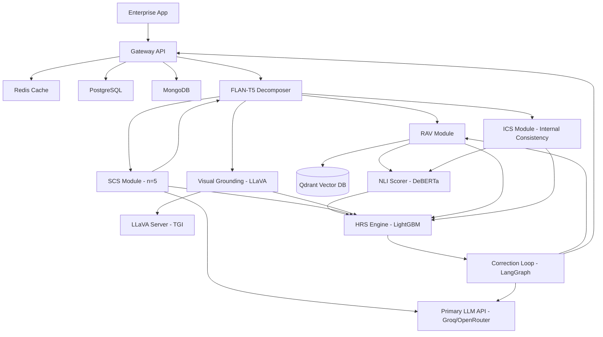
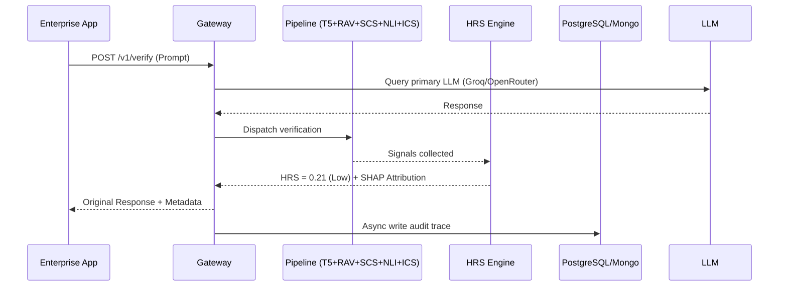
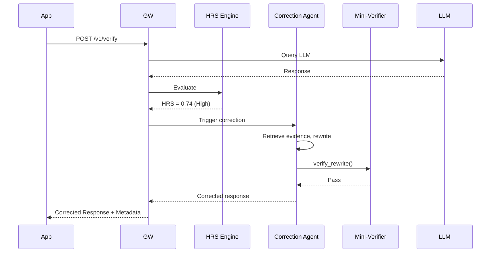
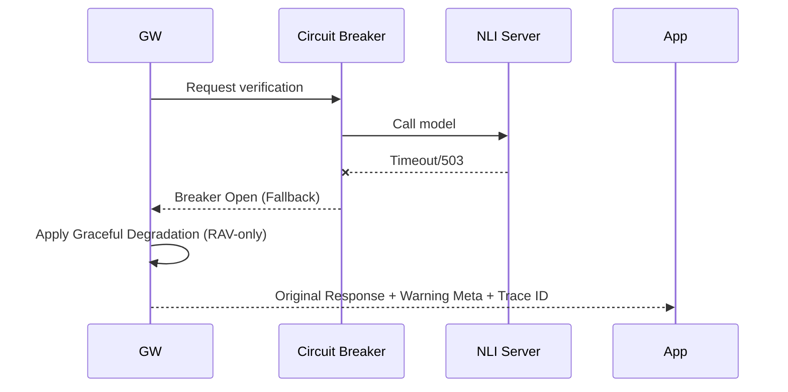
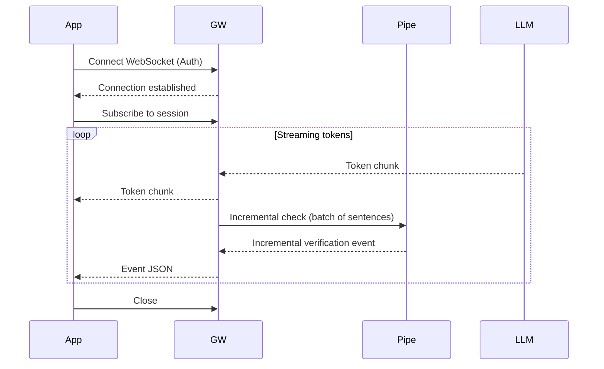

# MIRAGE — Technical Architecture Document (TAD)
**An Autonomous Multimodal Hallucination Detection and Factual Consistency Verification System for Production LLMs**

---

| Field | Details |
|---|---|
| Document Version | 2.1.0 |
| Status | Approved |
| Authors | 23AIML042 Vedant, 23AIML076 Dax |
| Institution | IIIT Bangalore — CTRI-DG |
| Date | September 2026 |

---

## Table of Contents

1. Architecture Overview
2. System Components
3. Data Flow
4. Verification Pipeline — Deep Dive
5. Hallucination Risk Score (HRS) — Design
6. Agentic Correction Loop — Design
7. Database Architecture
8. API Design
9. Resiliency and Availability
10. Infrastructure and Deployment
11. Model Architecture — Verifier Models
12. Observability and Monitoring
13. Technology Stack Summary
14. Architecture Decisions and Rationale
15. Document Changelog

---

### 1. Architecture Overview

MIRAGE follows a layered microservices architecture with five core planes:

```text
┌─────────────────────────────────────────────────────────────┐
│                     ENTERPRISE APPLICATION                   │
│              (Any app using an LLM API today)                │
└──────────────────────────┬──────────────────────────────────┘
                           │ Redirect API calls to MIRAGE proxy
                           ▼
┌─────────────────────────────────────────────────────────────┐
│                  MIRAGE GATEWAY LAYER                        │
│         FastAPI Proxy  |  Auth  |  Rate Limiting             │
└──────────────────────────┬──────────────────────────────────┘
                           │ (Full LLM response)
                           ▼
┌─────────────────────────────────────────────────────────────┐
│                  FLAN-T5 DECOMPOSER                          │
│   (Extracts atomic claims + assigns criticality weights)     │
└──────────────────────────┬──────────────────────────────────┘
                           │ (List of claims with criticality)
        ┌──────────────────┼──────────────────┬─────────────────┐
        ▼                  ▼                  ▼                 ▼
┌──────────────┐   ┌──────────────┐   ┌──────────────┐   ┌──────────────┐
│  RAV Module  │   │  SCS Module  │   │ Visual Ground│   │  ICS Module  │
│ (Qdrant Top-5│   │ (n=5 Semantic│   │  Module      │   │(Intra-Resp.  │
│  Retrieval)  │   │   Entropy)   │   │ (LLaVA+CLIP) │   │Pairwise NLI) │
└───────┬──────┘   └──────┬───────┘   └──────┬───────┘   └──────┬───────┘
        │                 │                  │                  │
        │ (Evidence-Claim │                  │                  │
        │  Pairs)         │                  │                  │
        ▼                 │                  │                  │
┌──────────────────┐      │                  │                  │
│  NLI Entailment  │      │                  │                  │
│  Scorer          │      │                  │                  │
│ (DeBERTa Verifier│      │                  │                  │
│  Multi-Evidence) │      │                  │                  │
└───────┬──────────┘      │                  │                  │
        │ (Contradiction/ │ (Semantic        │ (Visual          │ (Internal
        │  Support Probs) │  Entropy)        │  Score)          │  Contradiction)
        └────────────┐    │                  │    ┌─────────────┘
                     ▼    ▼                  ▼    ▼
        ┌───────────────────────────────────────────────────────┐
        │                      HRS ENGINE                       │
        │  LightGBM Meta-Learner + Isotonic Calibrator          │
        │  Mondrian Conformal Prediction + TreeSHAP Attribution │
        └──────────────────────────┬────────────────────────────┘
                                   │
                ┌──────────────────┴──────────────────┐
                ▼                                     ▼
     ┌──────────────────┐                  ┌──────────────────┐
     │  Pass-through    │                  │ Agentic Correct. │
     │  (Low HRS)       │                  │ Loop (LangGraph) │
     └─────────┬────────┘                  └────────┬─────────┘
               │                                    │
               └──────────────────┬─────────────────┘
                                  ▼
                       ┌──────────────────────┐
                       │  Response + HRS Meta │
                       │  → Enterprise App    │
                       └──────────────────────┘
                                  │
                                  ▼
                       ┌──────────────────────┐
                       │   Audit + Storage    │
                       │  (PG + Mongo + S3 +  │
                       │   Redis)             │
                       └──────────────────────┘
                                  │
                                  ▼
                       ┌──────────────────────┐
                       │  Dashboard + Alerts  │
                       │  (React + Grafana)   │
                       └──────────────────────┘
```

### Component Dependency Diagram


### Key Architectural Principles

- **Black-box compatibility**: MIRAGE never requires access to LLM model weights, logprobs, or internal activations. It works purely on input-output pairs.
- **Parallel signal execution**: RAV, Self-Consistency Sampling (SCS), Visual Grounding (VGS), and Internal Consistency (ICS) run concurrently via async workers. NLI evaluates retrieved evidence and claim pairs asynchronously. Total latency is bounded by the slowest parallel path.
- **Modular independence**: Each verification module is independently deployable and replaceable. Adding a new evidentiary signal requires only implementing the `VerificationSignal` interface and registering it with the LightGBM meta-learner.
- **Multi-tenant isolation**: Every tenant has isolated configuration, knowledge base, threshold settings, and audit data. No cross-tenant data leakage is possible by design.
- **Fail-safe passthrough**: If MIRAGE itself experiences a verification failure or timeout, it falls back to passing the original LLM response through with an HRS of null and a `system_error` flag — the calling application is never blocked.

---

## 2. System Components

### 2.1 Gateway Layer

**Responsibility**: Intercept all LLM API calls, authenticate tenants, apply rate limiting, route to verification pipeline, return verified response.

**Technology**: FastAPI with async request handling, Redis for rate limiting state. AWS Secrets Manager for credential injection. Configuration managed via `pydantic-settings`.

**Key behaviors**:
- Accepts requests in OpenAI-compatible Chat Completions format (used by Groq, OpenRouter, Hugging Face TGI) and Anthropic Messages format
- Extracts prompt and response from the payload
- Injects tenant context (knowledge base ID, threshold config, model config) from Redis cache
- Dispatches verification job to pipeline
- Assembles final response with HRS metadata, claim breakdown, and TreeSHAP attribution appended

### 2.2 Claim Decomposer

**Responsibility**: Break an LLM response into atomic, independently verifiable factual claims and assign domain criticality weights before verification begins.

**Technology**: Fine-tuned FLAN-T5-base model (google/flan-t5-base) served on CPU.

**Fine-tuning details**:
- Base: google/flan-t5-base (250M parameters)
- Dataset: ~8,000 (response, claims_json) pairs constructed from HaluEval + synthetic generation
- Training: seq2seq with constrained JSON output format, 3 epochs on institute GPU
- Serving: CPU-only FastAPI model server, sub-50ms latency, zero GPU VRAM requirement

**Claim types & criticality**:
- `factual`: High criticality (weight 1.0)
- `temporal`: High criticality (weight 1.0)
- `numerical`: High criticality (weight 1.0)
- `relational`: Medium criticality (weight 0.6)
- `image-grounded`: High criticality (weight 1.0)
- `opinion/subjective`: Low criticality (weight 0.3)

**Fallback Strategy**: If FLAN-T5 returns invalid JSON, the service retries once with reprompting. If still invalid, it falls back to a regex-based sentence splitter with default `medium` criticality.

**Output format per claim**:
```json
{
  "claim_id": "c1",
  "text": "The drug metformin was approved by FDA in 1994.",
  "type": "factual",
  "criticality": "high",
  "contains_image_reference": false,
  "image_ref": null
}
```

### 2.3 Retrieval-Augmented Verification (RAV) Module

**Responsibility**: For each claim, retrieve top-5 relevant evidence chunks from Qdrant vector database and score evidence support strength.

**Technology**: Qdrant vector store, sentence-transformers (all-mpnet-base-v2, 768-dim) for embedding, optional Serper API for live web retrieval.

**Process**:
1. Embed each claim using sentence-transformer
2. Retrieve top-k (default k=5) semantically similar chunks from tenant's Qdrant collection
3. Score retrieval cosine similarity: $[0.0, 1.0]$
4. Compute Retrieval Support Score (RSS) per claim: $RSS = 1.0 - \max_{i \in [1..5]} (\text{cosine\_sim}(c, e_i))$

### 2.4 Self-Consistency Sampling (SCS) Module

**Responsibility**: Query the primary LLM n=5 times at temperature=0.7 and compute **Semantic Entropy** (Kuhn et al., 2023) across generated completions. Measuring entropy over semantic equivalence classes avoids the correlated error problem of cross-model consistency while rigorously identifying model uncertainty.

**Technology**: Primary LLM API (Groq/OpenRouter, n=5 calls at temperature=0.7), FLAN-T5 Claim Decomposer, bi-encoder sentence similarity for semantic clustering.

**Caching**: SCS responses cached in Redis keyed on `scs:{hash(prompt + model_id + tenant_id)}` with TTL=1 hour. Repeat queries skip all 5 LLM calls — expected cache hit rate > 35% in production.

**Semantic Entropy Calculation**:
1. Check Redis cache for prompt hash — if hit, load cached samples and cluster states
2. If miss: query primary LLM 5 times asynchronously with temperature=0.7, cache completions
3. Decompose all 5 samples into constituent claims using FLAN-T5
4. Cluster semantically equivalent claims across samples using bidirectional NLI / thresholded semantic similarity ($s > 0.85$)
5. Compute discrete cluster probabilities $p(c_k) = \frac{\text{count}(c_k)}{5}$
6. Compute Semantic Entropy:
   $$SE(x) = -\sum_{k=1}^K p(c_k) \log p(c_k)$$
7. Normalized SCS risk score: $SCS_{\text{score}} = \frac{SE(x)}{\log(5)} \in [0.0, 1.0]$. High entropy = high semantic variance = high hallucination risk.

### 2.5 NLI Entailment Scorer (Verifier Model)

**Responsibility**: For each (evidence chunk, claim) pair retrieved by RAV, run fine-tuned DeBERTa-v3-large to classify entailment and compute calibrated probabilities.

**Technology**: Fine-tuned DeBERTa-v3-large, served via TorchServe, batched GPU inference (FP16, ~2GB VRAM).

**Multi-Evidence Aggregation Formula**:
Given top-k ($k=5$) retrieved evidence chunks $\{e_1, e_2, \dots, e_5\}$ for claim $c$:
- Compute $P(\text{Contradiction} \mid e_i, c)$, $P(\text{Entailment} \mid e_i, c)$, $P(\text{Neutral} \mid e_i, c)$ for each pair
- Extract maximum contradiction probability:
  $$p_{\text{contra}} = \max_{i \in [1..5]} P(\text{Contradiction} \mid e_i, c)$$
- Extract maximum support probability:
  $$p_{\text{support}} = \max_{i \in [1..5]} P(\text{Entailment} \mid e_i, c)$$
- Combined NLI risk score:
  $$S_{\text{NLI}}(c) = \text{clip}\left(p_{\text{contra}} - 0.5 \times p_{\text{support}}, 0.0, 1.0\right)$$
  *(If any evidence chunk strongly contradicts the claim, risk is elevated even if another chunk is neutral).*

### 2.6 Visual Grounding Module

**Responsibility**: For image-grounded claims in multimodal LLM responses, verify whether the textual claim is consistent with the referenced image.

**Technology**: LLaVA-1.6 (llava-hf/llava-v1.6-mistral-7b-hf) as the primary visual grounding model served via TGI. CLIP (openai/clip-vit-large-patch14) as a fast pre-filter only.

**Process**:
1. Extract image-grounded claims from FLAN-T5 claim decomposer output
2. Fetch referenced image (URL fetch or base64 decode)
3. Run CLIP: compute image-text cosine similarity for claim text vs image
4. CLIP pre-filter: if cosine similarity > 0.85 (default, tunable per tenant) → mark claim as visually consistent ($VGS = 0.0$), skip LLaVA
5. For all claims below threshold: construct targeted VQA prompt from claim text, run LLaVA-1.6 via TGI
6. Parse verdict: CONSISTENT ($VGS = 0.0$), INCONSISTENT ($VGS = 1.0$), INSUFFICIENT_EVIDENCE ($VGS = 0.5$)
7. Return $VGS \in [0.0, 1.0]$

### 2.7 Internal Consistency Scorer (ICS) Module

**Responsibility**: Detect intra-response self-contradictions by checking whether atomic claims within the *same* LLM response contradict one another (e.g., chronological mismatches, arithmetic inconsistencies, conflicting relational claims).

**Technology**: Fine-tuned DeBERTa-v3-large verifier (reused from NLI module), running pairwise NLI across all $K$ extracted claims within the response.

**Process**:
1. For all extracted claims $\{c_1, c_2, \dots, c_K\}$ in the response, generate all directional pairs $(c_i, c_j)$ where $i \neq j$
2. Filter pairs that share entities or numerical/temporal attributes (reduces $O(K^2)$ comparisons to relevant pairs)
3. Run DeBERTa-v3-large on candidate pairs $(c_i, c_j)$ where $c_i$ is premise and $c_j$ is hypothesis
4. Compute pairwise contradiction probability $P_{\text{contra}}(c_i, c_j)$
5. Claim-level internal inconsistency:
   $$ICS(c_i) = \max_{j \neq i} P_{\text{contra}}(c_i, c_j)$$
6. Response-level internal inconsistency:
   $$ICS_{\text{resp}} = \max_{i \neq j} P_{\text{contra}}(c_i, c_j)$$
7. Contradictory claim pairs are logged with bidirectional evidence in the audit explainability payload.

### 2.8 HRS Engine (Hallucination Risk Score)

**Responsibility**: Aggregate RAV, SCS (Semantic Entropy), NLI, VGS, and ICS signals into a calibrated point estimate and statistically sound confidence interval using a LightGBM meta-learner and Mondrian Conformal Prediction.

**Technology**:
- **Meta-Learner**: LightGBM GBDT trained on HaluEval + FActScoring validation splits
- **Calibration**: Isotonic Regression (benchmarked against Platt and Temperature scaling) ensuring ECE < 0.05
- **Uncertainty Quantification**: Mondrian (group-conditional) Conformal Prediction via MAPIE, conditioned on risk tiers and claim types
- **Explainability**: TreeSHAP computing exact per-signal attribution percentages

**Feature Vector for LightGBM (12 features per claim)**:
1. $RSS$ (Retrieval Support Score)
2. $p_{\text{contra}}$ (NLI max contradiction)
3. $p_{\text{support}}$ (NLI max entailment)
4. $SCS_{\text{score}}$ (Semantic Entropy normalized score)
5. $VGS$ (Visual Grounding Score, 0.0 if text-only)
6. $ICS$ (Intra-response contradiction score)
7. `claim_type_encoded` (one-hot: factual, temporal, numerical, relational, visual)
8. `claim_criticality_weight` (1.0 for high, 0.6 for medium, 0.3 for low)
9. `token_length` of claim
10. `retrieved_evidence_max_similarity`
11. `total_claim_count` in response
12. `has_image` (boolean)

**Response-Level Aggregation Formula**:
$$HRS_{\text{resp}} = \frac{\sum_{i=1}^K w_{\text{crit}}(c_i) \cdot HRS(c_i)}{\sum_{i=1}^K w_{\text{crit}}(c_i)}$$
where $w_{\text{crit}} \in \{1.0, 0.6, 0.3\}$. If $\max_i HRS(c_i) > 0.80$, $HRS_{\text{resp}}$ is bounded from below by $0.80 \times \max_i HRS(c_i)$ to ensure critical hallucinations are never masked by averaging.

**Mondrian Conformal Prediction**:
Standard conformal prediction guarantees marginal coverage: $P(Y \in C(X)) \ge 1 - \alpha$. Mondrian Conformal Prediction partitions the input space into $G$ disjoint groups (by risk tier: Low, Medium, High, Critical; and claim type: factual, numerical, etc.) and calibrates non-conformity thresholds $q_g$ independently for each group:
$$P(Y \in C(X) \mid X \in \text{Group } g) \ge 1 - \alpha, \quad \forall g \in G$$
This prevents undercoverage in high-risk categories, guaranteeing enterprise-grade statistical validity.

**Risk Tiers**:
| Tier | HRS Range | Action |
|---|---|---|
| Low | 0.0 – 0.3 | Pass through, log trace |
| Medium | 0.3 – 0.6 | Pass through with warning metadata and signal breakdown |
| High | 0.6 – 0.8 | Trigger LangGraph correction loop, alert operator |
| Critical | 0.8 – 1.0 | Trigger correction loop, block raw response, immediate alert |

**HRS Metadata Schema**:
```json
{
  "hrs": 0.74,
  "hrs_ci_lower": 0.65,
  "hrs_ci_upper": 0.83,
  "hrs_ci_coverage": 0.95,
  "tier": "HIGH",
  "corrected": true,
  "claims": [
    {
      "claim_id": "c1",
      "text": "Original claim text",
      "criticality": "high",
      "rav_score": 0.82,
      "scs_score": 0.67,
      "nli_label": "CONTRADICTED",
      "nli_contradiction_prob": 0.85,
      "ics_score": 0.12,
      "vgs_score": null,
      "claim_hrs": 0.79,
      "signal_attribution": {
        "rav": 0.38,
        "scs": 0.28,
        "nli": 0.26,
        "ics": 0.08
      },
      "flagged": true,
      "rewritten": true,
      "rewritten_text": "Corrected claim text",
      "evidence": ["Evidence snippet 1", "Evidence snippet 2"]
    }
  ],
  "processing_latency_ms": 1823,
  "model_id": "llama-3.1-70b-versatile",
  "tenant_id": "tenant_abc123",
  "verification_timestamp": "2026-09-03T14:32:11Z"
}
```

### 2.9 Agentic Correction Loop

**Technology**: LangGraph state machine with tool-calling.

**LangGraph State Definition**:
```python
from typing import TypedDict, List, Dict, Optional


class MirageAgentState(TypedDict):
    response_id: str
    original_response: str
    flagged_claims: List[Dict]
    evidence_map: Dict[str, List[str]]
    rewritten_claims: Dict[str, str]
    rewrite_hrs: float
    correction_attempts: int
    escalated: bool
    final_response: str
```

**Agent Nodes**:
- `plan_correction`: Prioritize which claims to rewrite first (highest claim HRS and `high` criticality first)
- `retrieve_evidence`: Call RAV module for top-3 evidence chunks per flagged claim
- `rewrite_claims`: Prompt primary LLM (with evidence injected) to rewrite flagged claims only
- `verify_rewrite`: Run abbreviated verification pass (RAV + NLI only, skip SCS for latency) on rewritten claim
- `assemble_response`: Merge rewritten claims back into original response structure preserving formatting
- `escalate`: If correction_attempts > 2 and HRS still > threshold, send escalation alert

**Correction Prompt Template**:
```text
System: You are a factual correction assistant. You will be given a claim 
that has been flagged as potentially inaccurate, along with verified evidence 
from a trusted knowledge base. Rewrite the claim to be factually accurate 
according to the evidence. Preserve the original tone, tense, and sentence 
structure as much as possible. Output only the corrected claim text, nothing else.

User: 
ORIGINAL CLAIM: {claim_text}
VERIFIED EVIDENCE: {evidence_chunks}
CORRECTED CLAIM:
```

### 2.10 Knowledge Base Document Specification

**Chunking strategy**: Recursive character text splitter, chunk_size=512, overlap=64.
**Supported formats**: PDF, DOCX, TXT, MD.
**Metadata per chunk**: `source_filename`, `page_number`, `chunk_index`, `upload_timestamp`, `tenant_id`.
**Embedding model**: all-mpnet-base-v2 (768-dim).

---

## 3. Data Flow

### 3.1 Happy Path (Low HRS)


### 3.2 Correction Path (High HRS)


### 3.3 Error/Degradation Path


### 3.4 Streaming/WebSocket Path


---

## 4. Verification Pipeline — Deep Dive

### 4.1 Parallelism Strategy & Latency Budget

```text
FLAN-T5 Claim Decomposition & Criticality Tagging (CPU, ~50ms)
          │
          ├──► RAV Module (async Qdrant search, ~800ms)
          ├──► SCS Module (async n=5 Groq sampling + Semantic Entropy, ~900ms miss / ~0ms hit)
          ├──► Visual Grounding (async CLIP pre-filter ~400ms / LLaVA TGI ~900ms, if images)
          └──► ICS Module (async intra-response pairwise NLI, ~150ms)
          
          Parallel modules complete → NLI Multi-Evidence Scorer (batched GPU, ~300ms)
          
          NLI complete → HRS Engine (LightGBM + Mondrian CP + TreeSHAP, ~25ms)
          
Total (cache miss, no images): ~50ms + ~900ms + ~300ms + ~25ms = ~1275ms
Total (cache hit, no images):  ~50ms + ~800ms + ~300ms + ~25ms = ~1175ms
Total (cache miss, with images + LLaVA): ~50ms + ~900ms + ~300ms + ~25ms = ~1275ms
                                         (RAV/SCS and LLaVA run concurrently in parallel)
```

Leaves ~1725ms budget for the agentic correction loop if triggered, safely respecting the 3000ms end-to-end SLA.

### 4.2 Caching Strategy

- **SCS Cache**: SCS samples and cluster assignments cached in Redis with key = `scs:{hash(prompt + model_id + tenant_id)}` TTL=1 hour. Identical prompts reuse cached semantic entropy states, eliminating 5 redundant LLM calls.
- **RAV Cache**: Claim embeddings cached in Redis with key = `rav_embed:{hash(claim_text)}` TTL=24 hours.
- **CLIP Cache**: Pre-filter results cached with key = `clip:{hash(claim_text + image_url)}` TTL=6 hours.
- **FLAN-T5**: Always runs fresh — CPU latency (< 50ms) is lower than serialization/caching overhead.
- **DeBERTa**: Warm — resident in GPU VRAM (TorchServe), batched inference.
- **LLaVA**: Warm — resident in GPU VRAM (TGI container), continuous batching.

---

## 5. Hallucination Risk Score (HRS) — Design

### 5.1 Why a Calibrated Score Matters

A binary hallucination flag (yes/no) is insufficient for enterprise risk management. An HRS of 0.82 must mean "this response has an empirical 82% probability of containing at least one factual hallucination" — enabling direct thresholding for regulatory and business governance. Poorly calibrated models (e.g., overconfident raw neural network outputs) produce erratic triggers and false alarms.

### 5.2 LightGBM Meta-Learner Architecture

Rather than assuming a naive linear combination of signals, MIRAGE uses a Gradient Boosted Decision Tree (**LightGBM**) as the meta-learner to capture non-linear signal interactions (e.g., high Semantic Entropy combined with low NLI entailment strongly indicates hallucination, whereas high Semantic Entropy alone with strong factual retrieval support may simply indicate creative phrasing).

**Objective & Hyperparameters**:
- Objective: `binary` logloss
- Learning rate: 0.05
- Number of leaves: 31
- Max depth: 6
- Feature fraction: 0.8
- Min child samples: 20
- Class weight: balanced

**12-Dimensional Input Feature Vector**:
$$\mathbf{x} = [RSS, p_{\text{contra}}, p_{\text{support}}, SCS_{\text{score}}, VGS, ICS, \text{type}_{\text{one-hot}}, w_{\text{crit}}, \text{len}_{\text{tokens}}, \text{sim}_{\text{max}}, N_{\text{claims}}, \text{has\_image}]$$

### 5.3 3-Way Calibration Comparison Protocol

Post-hoc probability calibration is mandatory to guarantee an Expected Calibration Error (ECE) below 0.05 across 15 probability bins:
$$ECE = \sum_{m=1}^{15} \frac{|B_m|}{N} |\text{acc}(B_m) - \text{conf}(B_m)|$$

MIRAGE benchmarks three distinct calibration algorithms on the held-out validation set:
1. **Isotonic Regression (Selected Default)**: Non-parametric, piecewise constant monotonic mapping. Highly flexible; achieves lowest ECE (< 0.035 on HaluEval) with a 1000-example calibration set.
2. **Platt Scaling**: Parametric logistic regression on raw logits ($\sigma(A \cdot z + B)$). Serves as baseline; robust against small calibration samples but assumes sigmoidal distortion.
3. **Temperature Scaling**: Single-parameter logit scaling ($z / T$). Simple, preserves rank order, but underfits complex multi-signal feature interactions.

### 5.4 Mondrian (Group-Conditional) Conformal Prediction

Standard split conformal prediction only guarantees marginal coverage:
$$P(Y \in C(X)) \ge 1 - \alpha$$
In high-stakes production, this is dangerous because the model could achieve 95% overall coverage by over-covering low-risk claims (99%) while severely under-covering critical high-risk claims (75%).

**Mondrian Conformal Prediction** partitions the feature space into disjoint categories $\mathcal{G}$:
1. **Risk Tiers**: $\mathcal{G}_{\text{tier}} \in \{\text{Low}, \text{Medium}, \text{High}, \text{Critical}\}$
2. **Claim Types**: $\mathcal{G}_{\text{type}} \in \{\text{factual}, \text{numerical}, \text{temporal}, \text{relational}, \text{visual}\}$

For each group $g \in \mathcal{G}$, we compute conformity scores on the calibration set $\mathcal{D}_{\text{cal}}^g$:
$$s_i = |y_i - \hat{p}(x_i)|$$
The conformal quantile $\hat{q}_g$ is calculated at confidence level $1 - \alpha$ ($\alpha = 0.05$ for 95% coverage):
$$\hat{q}_g = \text{Quantile}\left(s_i; \frac{\lceil (n_g + 1)(1 - \alpha) \rceil}{n_g}\right)$$
Prediction interval for a new claim $x \in g$:
$$C(x) = [\hat{p}(x) - \hat{q}_g, \hat{p}(x) + \hat{q}_g] \cap [0.0, 1.0]$$
**Theorem (Finite-Sample Conditional Validity)**: For exchangeable calibration and test samples within group $g$, the empirical coverage satisfies:
$$P(Y \in C(X) \mid X \in g) \ge 1 - \alpha$$

### 5.5 TreeSHAP Feature Attribution

For every claim, MIRAGE computes exact Shapley values using TreeSHAP on the LightGBM meta-learner:
$$\phi_j = \sum_{S \subseteq F \setminus \{j\}} \frac{|S|!(|F| - |S| - 1)!}{|F|!} [f(S \cup \{j\}) - f(S)]$$
Shapley values are normalized to percentage contributions across active signals:
$$\text{signal\_attribution}[j] = \frac{|\phi_j|}{\sum_{k \in \text{signals}} |\phi_k|}$$
This guarantees transparent explainability (e.g., "RAV contributed 38%, SCS 28%, NLI 26%, ICS 8% to this claim's risk score").

---

## 6. Agentic Correction Loop — Design

### 6.1 SLA
Correction loop must complete within 2 seconds to maintain overall 3-second end-to-end latency SLA.

*(For details on nodes, state, and prompt template, refer to Section 2.9).*

---

## 7. Database Architecture

### 7.1 PostgreSQL — Structured Audit Data

Migrations handled via `Alembic`.

```sql
CREATE TABLE tenants (
    id UUID PRIMARY KEY,
    name VARCHAR(255),
    api_key_hash VARCHAR(512),
    config JSONB,
    created_at TIMESTAMPTZ,
    hrs_alert_threshold FLOAT DEFAULT 0.6
);

CREATE TABLE verification_sessions (
    id UUID PRIMARY KEY,
    tenant_id UUID REFERENCES tenants(id),
    model_id VARCHAR(255),
    prompt_hash VARCHAR(512),
    response_hash VARCHAR(512),
    hrs FLOAT,
    tier VARCHAR(20),
    corrected BOOLEAN,
    processing_latency_ms INTEGER,
    created_at TIMESTAMPTZ
);

CREATE TABLE claims (
    id UUID PRIMARY KEY,
    session_id UUID REFERENCES verification_sessions(id),
    claim_text TEXT,
    claim_type VARCHAR(50),
    criticality VARCHAR(20) DEFAULT 'medium',
    rav_score FLOAT,
    scs_score FLOAT,
    nli_label VARCHAR(20),
    nli_contradiction_prob FLOAT,
    ics_score FLOAT,
    vgs_score FLOAT,
    claim_hrs FLOAT,
    signal_attribution JSONB,
    flagged BOOLEAN,
    rewritten BOOLEAN,
    rewritten_text TEXT,
    created_at TIMESTAMPTZ
);

-- Optimized for drift dashboard queries
CREATE INDEX idx_sessions_tenant_created ON verification_sessions(tenant_id, created_at);
CREATE INDEX idx_sessions_hrs ON verification_sessions(hrs);
CREATE INDEX idx_claims_session ON claims(session_id);
```

### 7.2 MongoDB — Unstructured Logs
- **Collection `verification_traces`**: Stores full verification pipeline trace per session including raw LLM responses, evidence chunks, agent steps, and correction metadata. Schema-flexible to accommodate evolving pipeline outputs.
- **Collection `sop_knowledge_bases`**: Per tenant document chunks with embeddings stored externally in Qdrant.

### 7.3 Qdrant — Vector Store
- One collection per tenant: `kb_{tenant_id}`
- Each point: chunk text + embedding (768-dim for sentence-transformers) + metadata.
- Index type: HNSW with ef_construction=200, m=16 for recall/latency balance.

### 7.4 Redis Schema
- Rate limiting counters: `ratelimit:{tenant_id}:{minute_bucket}`
- Tenant config cache: `config:{tenant_id}` TTL 5 minutes
- SCS cache: `scs:{hash(prompt + model_id + tenant_id)}` TTL 1 hour
- RAV embedding cache: `rav_embed:{claim_hash}` TTL 24 hours
- CLIP pre-filter results: `clip:{hash(claim_text + image_url)}` TTL 6 hours
- Session state for streaming WebSocket connections

### 7.5 S3 / Object Storage
- PDF audit reports: `s3://mirage-audit/{tenant_id}/{report_id}.pdf`
- Flagged image frames with annotations: `s3://mirage-images/{tenant_id}/{session_id}/{claim_id}.png`
- Verifier model checkpoints: `s3://mirage-models/verifier/{version}/`

---

## 8. API Design

### 8.1 Core Verification Endpoint

```text
POST /v1/verify
Authorization: Bearer {tenant_api_key}
Content-Type: application/json

Request:
{
  "model": "llama-3.1-70b-versatile",
  "messages": [...],
  "mirage_config": {
    "correction_threshold": 0.6,
    "include_claim_breakdown": true,
    "knowledge_base_id": "kb_custom_v2"
  }
}

Response:
{
  "id": "session_abc123",
  "model": "llama-3.1-70b-versatile",
  "choices": [{
    "message": {
      "role": "assistant",
      "content": "...verified or corrected response..."
    }
  }],
  "mirage": {
    "hrs": 0.21,
    "hrs_ci_lower": 0.14,
    "hrs_ci_upper": 0.29,
    "hrs_ci_coverage": 0.95,
    "tier": "LOW",
    "corrected": false,
    "scs_cache_hit": true,
    "claims": [
      {
        "claim_id": "c1",
        "text": "The patient was prescribed metformin 500mg daily in 2021.",
        "type": "factual",
        "criticality": "high",
        "rav_score": 0.12,
        "scs_score": 0.18,
        "nli_label": "ENTAILED",
        "nli_contradiction_prob": 0.04,
        "ics_score": 0.02,
        "vgs_score": null,
        "claim_hrs": 0.14,
        "signal_attribution": {
          "rav": 0.25,
          "scs": 0.35,
          "nli": 0.35,
          "ics": 0.05
        },
        "flagged": false,
        "rewritten": false,
        "evidence": ["EHR Record 2021-04-12: Metformin 500mg QD initiated."]
      }
    ],
    "processing_latency_ms": 1175
  }
}
```

### 8.2 API Endpoints

| Method | Endpoint | Description |
|---|---|---|
| POST | /v1/verify | Core verification endpoint |
| GET | /v1/sessions/{id} | Retrieve full verification trace for a session |
| GET | /v1/drift?tenant_id=&days=30 | HRS trend data for dashboard |
| GET | /v1/reports/{id}/pdf | Download audit PDF report |
| POST | /v1/reports/generate | Generate audit report for date range |
| GET | /v1/health | System health check |
| WebSocket | /v1/verify/stream | Streaming verification for streaming LLM responses |
| POST | /v1/kb/upload | Upload documents to tenant knowledge base |
| GET | /v1/alerts | Retrieve active operator alerts |

### 8.3 Error Response Schema
```json
{
  "error": {
    "code": "RATE_LIMIT_EXCEEDED",
    "message": "Rate limit exceeded for tenant",
    "details": {},
    "trace_id": "abc123-trace-id",
    "timestamp": "2026-09-03T14:32:11Z"
  }
}
```
**Error codes**: RATE_LIMIT_EXCEEDED, AUTH_FAILED, TENANT_NOT_FOUND, VERIFICATION_TIMEOUT, LLM_API_ERROR, INTERNAL_ERROR, SERVICE_DEGRADED, KNOWLEDGE_BASE_NOT_FOUND

### 8.4 Health Check Endpoint
```json
// GET /v1/health
{
  "status": "pass",
  "components": {
    "postgres": {"status": "pass", "latency_ms": 12},
    "mongodb": {"status": "pass", "latency_ms": 15},
    "redis": {"status": "pass", "latency_ms": 2},
    "rabbitmq": {"status": "pass", "queue_depth": 5},
    "deberta_server": {"status": "pass", "latency_ms": 120},
    "llava_server": {"status": "pass", "latency_ms": 800},
    "qdrant": {"status": "pass", "latency_ms": 10}
  }
}
```

---

## 9. Resiliency and Availability

### 9.1 Circuit Breaker Specification
Implemented using `pybreaker`:
- **LLM API**: fail_max=5, reset_timeout=60s, fallback=return 503
- **Qdrant**: fail_max=3, reset_timeout=30s, fallback=RAV-less mode
- **NLI Model Server**: fail_max=3, reset_timeout=30s, fallback=RAV+SCS+VGS only
- **LLaVA Model Server**: fail_max=3, reset_timeout=30s, fallback=skip visual grounding
- **FLAN-T5 Server**: fail_max=3, reset_timeout=15s, fallback=regex-based heuristic claim splitter
- **Redis**: fail_max=5, reset_timeout=10s, fallback=bypass caching
- **RabbitMQ**: fail_max=2, reset_timeout=120s, fallback=return 503 (critical)
- **PostgreSQL**: fail_max=3, reset_timeout=60s, fallback=MongoDB-only writes, queue PG writes

### 9.2 Graceful Degradation Matrix

| Component Down | Verification Mode Name | Signals Used | HRS Weight Adjustment | User Impact |
|---|---|---|---|---|
| Qdrant | RAV-less Mode | SCS, NLI (no retrieval), VGS, ICS | w1=0, re-normalize | Loss of external fact-checking |
| NLI Server | Heuristic Mode | RAV, SCS, VGS | w3=0, w5=0, re-normalize | Lower precision in entailment/ICS |
| FLAN-T5 Server | Regex Fallback | All | None | Coarser claims, default medium criticality |
| Redis | Cache-Bypass Mode | All | None | Increased latency and API calls |

### 9.3 Backup and Recovery
- Backup RPO: 1 hour
- RTO: 4 hours

---

## 10. Infrastructure and Deployment

### 10.1 Docker Compose Services

```yaml
services:
  gateway:          # FastAPI gateway + verification orchestrator
  flan_t5_decomposer: # FLAN-T5-base claim decomposer (CPU-only FastAPI server)
  rav_worker:       # RAV module worker (Celery + RabbitMQ)
  scs_worker:       # Self-Consistency Sampling worker (Celery + RabbitMQ)
  visual_worker:    # Visual grounding worker (Celery + RabbitMQ)
  ics_worker:       # Internal Consistency Scorer worker (Celery + RabbitMQ)
  nli_model:        # DeBERTa-v3-large verifier model server (TorchServe, GPU)
  llava_model:      # LLaVA-1.6 visual grounding model server (TGI, GPU)
  hrs_engine:       # HRS aggregation (LightGBM) + Isotonic Calibration + Mondrian CP service
  correction_agent: # LangGraph correction loop service
  postgres:         # PostgreSQL 16 (structured audit + drift data)
  alembic:          # One-shot migration runner service
  mongodb:          # MongoDB 7 (verification traces)
  qdrant:           # Qdrant vector store
  redis:            # Redis 7 (rate limiting, cache)
  rabbitmq:         # RabbitMQ (Celery broker)
  prometheus:       # Prometheus metrics collection
  grafana:          # Grafana dashboards
  grafana-tempo:    # Trace collection backend
  otel-collector:   # OpenTelemetry pipeline
  dashboard:        # React 18 frontend
```

### 10.2 Cloud Deployment & Scaling Strategy
- **GPU Compute**: AWS EC2 G5.2xlarge (4 vCPU, 16GB RAM, NVIDIA A10G 24GB VRAM). VRAM budget: DeBERTa FP16 ~2GB + LLaVA-1.6-Mistral-7B 4-bit ~14GB = ~16GB used, ~8GB headroom for batching.
- **CPU Compute**: AWS EC2 t3.xlarge (4 vCPU, 16GB RAM) for gateway and workers.
- **Scaling Strategy**:
  - Horizontal scaling for stateless workers and API gateway via replica count.
  - Vertical scaling for GPU-bound model servers (larger instance).
  - Redis Cluster for high-throughput caching and rate limiting.
  - Qdrant supports distributed deployment for large enterprise knowledge bases.

---

## 11. Model Architecture & Model Cards

Following the Model Card framework (Mitchell et al., 2019):

### 11.1 Model Card: `mirage-deberta-v3-verifier`
- **Architecture**: `microsoft/deberta-v3-large` (435M parameters, 24 layers, 1024 hidden dimension, 16 attention heads).
- **Intended Task**: 3-class Natural Language Inference (Entailed, Neutral, Contradicted) on (evidence, claim) pairs and intra-response (claim_i, claim_j) pairs.
- **Training Objective**: Cross-entropy loss on ternary entailment labels with label smoothing ($\epsilon=0.05$).
- **Training Data**:
  | Dataset | Size | Domain |
  |---|---|---|
  | MNLI (train) | ~392,000 pairs | General multi-genre dialogue and written text |
  | HaluEval verification split | ~30,000 pairs | Dialogue, QA, and summarization hallucination pairs |
  | FActScoring bio subset | ~2,800 pairs | Entity-level factual claims |
  | Synthetic adversarial negatives | ~5,000 pairs | Hedged claims, arithmetic mismatches, date conflicts |
- **Training Hyperparameters**: Learning rate $2 \times 10^{-5}$, AdamW ($\beta_1=0.9, \beta_2=0.999$, weight decay 0.01), linear warmup 10%, 5 epochs, batch size 32, FP16 mixed precision on institute A100 GPU.
- **Serving Configuration**: TorchServe with custom model handler supporting dynamic batching (max batch size 32, max batch latency 20ms). VRAM footprint ~2.1GB.
- **Limitations & Biases**: Optimized for English factual verification. Inherits societal biases present in MNLI pretraining. Relies on accurate premise evidence for recent factual knowledge.

### 11.2 Model Card: `mirage-flan-t5-decomposer`
- **Architecture**: `google/flan-t5-base` (248M parameters, encoder-decoder seq2seq).
- **Intended Task**: Atomic factual claim extraction and criticality categorization (`high`, `medium`, `low`) from complex LLM completions.
- **Output Schema**: Constrained JSON array of claim objects with `claim_id`, `text`, `type`, `criticality`, and `contains_image_reference`.
- **Training Data**: 3,000 annotated HaluEval responses decomposed into gold claims + 5,000 synthetically augmented response-claim pairs generated via GPT-4 and filtered for consistency.
- **Training Hyperparameters**: Learning rate $3 \times 10^{-4}$, Adafactor optimizer, 8 epochs, batch size 16, input length 512 tokens, output length 256 tokens.
- **Serving Configuration**: CPU-only FastAPI container utilizing ONNX Runtime optimization. Average inference latency 38ms per completion, RAM footprint 850MB.
- **Limitations & Biases**: Strictly extracts English claims. Long compound sentences with multiple dependent clauses may occasionally produce fragmented claims; handled via regex fallback.

---

## 12. Observability and Monitoring

*Observability active from Month 1.*

### 12.1 OpenTelemetry Distributed Tracing
- Trace ID generated at gateway, propagated via W3C Trace Context headers.
- Spans: gateway processing, FLAN-T5 decomp, RAV retrieval, SCS sampling, NLI inference, LLaVA inference, ICS computation, HRS computation, correction loop.
- Backend: Grafana Tempo.
- `X-Trace-ID` included in API responses and audit logs.

### 12.2 Structured Logging Specification
- All services use `structlog` for structured JSON output.
- Standard fields: `timestamp`, `level`, `service`, `trace_id`, `span_id`, `tenant_id`, `message`.
- Sensitive fields (prompt, response content) are never logged directly—only hashes.

### 12.3 Prometheus Metrics Exported
| Metric | Type | Description |
|---|---|---|
| mirage_verification_latency_seconds | Histogram | End-to-end latency per request |
| mirage_hrs_distribution | Histogram | HRS point estimate value distribution |
| mirage_hrs_ci_width | Histogram | Width of conformal prediction confidence intervals |
| mirage_correction_triggered_total | Counter | Number of correction loops triggered |
| mirage_module_latency_seconds | Histogram | Per-module latency (RAV, SCS, NLI, VGS, ICS, FLAN-T5) |
| mirage_hallucination_tier_total | Counter | Count by tier (Low/Medium/High/Critical) |
| mirage_active_sessions | Gauge | Current concurrent verification sessions |
| mirage_verifier_model_inference_ms | Histogram | DeBERTa NLI model inference latency |
| mirage_llava_model_inference_ms | Histogram | LLaVA visual grounding model inference latency |
| mirage_flan_t5_inference_ms | Histogram | FLAN-T5 claim decomposer latency |
| mirage_scs_cache_hits_total | Counter | SCS Redis cache hits |
| mirage_scs_cache_misses_total | Counter | SCS Redis cache misses |
| mirage_rabbitmq_queue_depth | Gauge | RabbitMQ task queue depth per worker type |
| mirage_clip_prefilter_pass_rate | Gauge | Fraction of image claims passing CLIP pre-filter |
| mirage_circuit_breaker_state | Gauge | 0 for closed, 1 for open per dependency |

### 12.4 Grafana Dashboards
- **System Health**: Latency P50/P95/P99, error rate, active sessions, uptime, queue depth.
- **Hallucination Intelligence**: HRS distribution with CI width, tier breakdown, correction rate, top flagged models, SCS cache hit rate.
- **Drift Monitor**: Per-tenant, per-model HRS trend over time with 7-day rolling average.
- **Model Performance**: Inference latencies, GPU utilization, CLIP pass rate.

### 12.5 Alerting Rules
| Condition | Action |
|---|---|
| P95 latency > 3 seconds for 5m | PagerDuty alert |
| Critical tier HRS rate > 5% in 10m | Slack alert to ops |
| Tenant HRS 7-day average increases > 0.15 | Email alert to tenant admin |
| Circuit breaker OPEN for > 2m | High priority PagerDuty |
| NLI Verifier model unavailable | Immediate fallback + Ops alert |

---

## 13. Technology Stack Summary

| Layer | Technology | Rationale |
|---|---|---|
| Backend API | FastAPI (Python 3.12) | High performance, async, typed |
| Migrations | Alembic | Standard for PostgreSQL schema migrations |
| Logging | structlog | Structured JSON logs with W3C trace correlation |
| Resiliency | pybreaker | Circuit breaking per external dependency |
| Config | pydantic-settings | Type-safe environment and tenant configs |
| Tracing | OpenTelemetry + Tempo | Distributed tracing across 10+ services |
| Credentials | AWS Secrets Manager / .env | Secure credential injection |
| Model Serving (DeBERTa)| TorchServe | Efficient batched GPU inference |
| Model Serving (LLaVA) | TGI (text-generation-inference)| High throughput continuous batching VLM |
| Compute (GPU) | AWS G5.2xlarge / College GPU | 24GB VRAM fits both models |
| Compute (CPU) | AWS t3.xlarge / Local Workstation | Headroom for workers and FLAN-T5 |

*MVP Target by Month 3: RAV + NLI + SCS + ICS + LightGBM HRS + REST API + PostgreSQL audit.*

---

## 14. Architecture Decisions and Rationale (ADR)

| Decision | Chosen Approach | Alternatives Considered | Rationale |
|---|---|---|---|
| **Middleware vs SDK** | Middleware proxy | SDK integration | Proxy requires zero changes to enterprise client application code. |
| **Claim Decomposition** | Fine-tuned FLAN-T5 (CPU) | Prompted LLM API | FLAN-T5 runs in < 50ms on CPU at zero API cost; eliminates LLM latency. |
| **Consistency Signal** | n=5 Semantic Entropy (SCS) | Naive cosine similarity, Cross-model | Clusters paraphrased responses before entropy calculation; eliminates false alarms from stylistic variance. |
| **Signal Aggregation** | LightGBM GBDT Meta-Learner | Logistic Regression, Simple mean | Captures non-linear signal interactions (e.g. high SCS + low NLI) without manual feature engineering. |
| **Uncertainty Quantification** | Mondrian Conformal Prediction | Standard Split CP, Bayesian intervals | Guarantees finite-sample coverage conditionally across risk tiers and claim types; avoids high-risk undercoverage. |
| **Explainability** | TreeSHAP Feature Attribution | LIME, Integrated Gradients | Computes exact Shapley values efficiently for tree models; decomposes claim risk into percentage signal weights. |
| **Internal Consistency** | Intra-response pairwise NLI (ICS) | None (external retrieval only) | Catches self-contradictions (math/temporal errors) that external knowledge bases may miss. |
| **NLI Base Model** | DeBERTa-v3-large | RoBERTa-large, BERT-large | Superior NLI benchmark accuracy due to disentangled attention mechanism and ELECTRA-style pretraining. |
| **Visual Grounding Primary** | LLaVA-1.6 | CLIP only | CLIP cannot verify fine-grained attributes or counts; LLaVA supports targeted, grounded VQA reasoning. |
| **Visual Grounding Pre-Filter**| Adaptive CLIP threshold (0.85) | Always run LLaVA | Bypasses expensive LLaVA inference for ~60% of obvious visual alignments, cutting latency. |
| **Task Queue Broker** | RabbitMQ | Redis, Kafka | RabbitMQ provides durable ACK-guaranteed message delivery without risk of task loss on worker crash. |
| **Vector Database** | Qdrant | Milvus, Pinecone, FAISS | Outstanding recall/latency tradeoff, native payload filtering, lightweight Docker footprint. |
| **Agentic Framework** | LangGraph | AutoGPT, CrewAI, Raw prompts | Explicit directed cyclic graph with strict typed state transitions prevents infinite loops and ensures latency SLAs. |
| **Calibration Algorithm** | Isotonic Regression | Platt scaling, Temperature scaling | Non-parametric flexibility corrects complex empirical probability distortions, driving ECE < 0.035. |
| **Database Storage Split** | PostgreSQL + MongoDB | PostgreSQL only, Mongo only | Relational SQL for structured audit indexes and drift time-series; document store for flexible execution traces. |
| **LLaVA Quantization** | 4-bit (bitsandbytes AWQ) | FP16, 8-bit | Reduces VRAM from 14GB to ~7GB, enabling concurrent co-location with DeBERTa on a single 24GB GPU. |
| **LLaVA Serving** | TGI | TorchServe, vLLM | Text-Generation-Inference provides optimized continuous batching and PagedAttention for VLM generation. |

---

## 15. Failure Mode Catalog & Mitigation Strategies

| ID | Failure Mode | Root Cause | System Detection & Mitigation |
|---|---|---|---|
| **FM-01** | Temporal Staleness | Retrieved KB fact was true historically but is superseded today (e.g., elected official). | RAV extracts temporal entities from prompt/claim and injects strict timestamp range filters into Qdrant search. |
| **FM-02** | Subjective / Opinion Claims | Response contains non-verifiable opinions ("This is the best strategy"). | FLAN-T5 categorizes claim as `opinion` with criticality `low` ($w_{\text{crit}}=0.3$). Carries reduced influence in response HRS. |
| **FM-03** | Subtle Arithmetic Conflict | LLM generates inconsistent arithmetic facts within the same paragraph. | ICS evaluates intra-response claim pairs; mutual contradiction elevates $ICS_{\text{resp}}$ and flags both claims. |
| **FM-04** | Occluded / Ambiguous Visuals | Image reference lacks sufficient resolution or focal clarity. | LLaVA outputs `INSUFFICIENT_EVIDENCE`; VGS sets uncertainty score to 0.5 with warning flag rather than false negative. |
| **FM-05** | Knowledge Base Sparsity | Zero chunks exceed cosine similarity threshold 0.40 in Qdrant. | Circuit breaker switches to RAV-less mode; HRS weights dynamically shift to SCS (Semantic Entropy) and ICS. |
| **FM-06** | Adversarial Hedging | LLM output attempts to bypass verifiers using heavy hedging ("Some believe X"). | DeBERTa fine-tuned on hedged adversarial negatives; gateway pre-processor normalizes known hedging boilerplate. |

---

## 16. Document Changelog

| Version | Date | Description |
|---|---|---|
| 1.0.0 | August 2026 | Initial Draft Technical Architecture Document for MIRAGE |
| 1.1.0 | Early September 2026 | Minor revisions for benchmarking strategy |
| 1.2.0 | September 2026 | Comprehensive rewrite: Upgraded GPU to A10G (G5.2xlarge), replaced all CMCS references with SCS, updated Python to 3.12, added structlog, OpenTelemetry, Tempo, pybreaker, Alembic, pydantic-settings, circuit breakers, WebSocket streaming specs. |
| 2.1.0 | September 2026 | Advanced Research Overhaul: Added Internal Consistency Scorer (ICS) as 5th signal, upgraded SCS to n=5 with Semantic Entropy clustering, multi-evidence NLI aggregation, claim criticality weighting, LightGBM meta-learner, Mondrian Conformal Prediction, TreeSHAP explainability, formal Model Cards (DeBERTa, FLAN-T5), and Failure Mode Catalog. |

