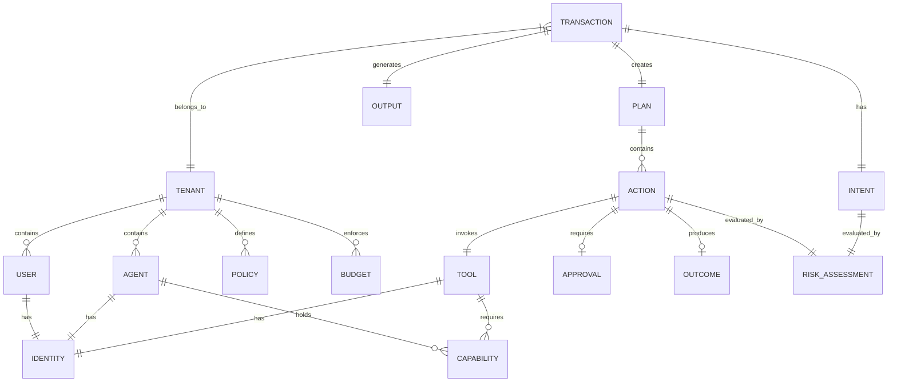

# MIRAGE 3.0 — Data Model

> **Status:** Authoritative | **Version:** 3.0.0-draft | **Date:** 2026-10-05
>
> This document defines the canonical entities, their relationships, and the storage architecture for MIRAGE 3.0.

---

## 1. Canonical Entities

| Entity | Key Fields | Ownership / Tenancy | Description |
|---|---|---|---|
| **Tenant** | id, name, config, status | System | Isolated boundary for data, policy, and access. |
| **User** | id, tenant_id, role, credentials | Tenant | Human actor interacting with MIRAGE. |
| **Identity** | id, type (user/agent/tool), public_key | Tenant | Verifiable identity for any actor. |
| **Agent** | id, tenant_id, name, base_capabilities | Tenant | Autonomous AI system. |
| **Model** | id, provider, capabilities, cost_profile | System/Tenant | AI model used for inference/verification. |
| **Capability** | id, name, scope, resource_pattern | Tenant | Permission to perform an action. |
| **Tool** | id, name, schema, trust_level, mcp_ref | Tenant | Executable function or API. |
| **Policy** | id, tenant_id, rule_definition, scope | Tenant | Declarative rule constraining behavior. |
| **Intent** | id, transaction_id, classification, risk | Tenant | Inferred purpose of a request. |
| **Evidence** | id, content, provenance_id, confidence | Tenant | Information used to verify claims. |
| **Memory** | id, tenant_id, owner_id, content, ttl | Tenant | Governed persistent information. |
| **Transaction**| id, tenant_id, status, assurance_score | Tenant | End-to-end unit of AI work. |
| **Plan** | id, transaction_id, status | Tenant | Ordered sequence of intended actions. |
| **Action** | id, plan_id, tool_id, parameters, status | Tenant | Discrete operation affecting state. |
| **Approval** | id, action_id, approver_id, decision | Tenant | Explicit authorization for an action. |
| **RiskAssessment**| id, target_id, risk_score, blast_radius | Tenant | Computed risk for intent/action. |
| **Budget** | id, tenant_id, limits, usage, period | Tenant | Resource consumption limits. |
| **Output** | id, transaction_id, content, verified | Tenant | Generated response. |
| **Outcome** | id, action_id, actual_state, matched | Tenant | Real-world state change result. |
| **ProvenanceEvent**| id, entity_id, origin, timestamp | Tenant | Lineage tracking record. |
| **AuditEvent** | id, tenant_id, action, hash, prev_hash| Tenant | Cryptographically verifiable log. |

---

## 2. Entity-Relationship Diagram

---

## 3. Storage Mapping

MIRAGE uses a polyglot persistence architecture to handle diverse workload characteristics.

### 3.1 PostgreSQL (Control Plane & Core Relations)
- **Entities:** Tenant, User, Agent, Policy, Capability, Budget, AuditEvent.
- **Rationale:** Control plane data requires strict ACID properties, relational integrity, and robust Row-Level Security (RLS) for tenant isolation. The Audit log is kept here to build cryptographic chains.

### 3.2 MongoDB (Execution Traces)
- **Entities:** Transaction, Plan, Action, Output, Outcome, RiskAssessment, Intent.
- **Rationale:** AI execution traces generate massive, append-heavy, nested document structures. MongoDB provides the flexible schema necessary as AI interaction patterns evolve, along with TTL support for transient trace data.

### 3.3 Redis (Runtime State)
- **Entities:** Active Sessions, Rate Limits, Circuit Breakers, Working Memory.
- **Rationale:** Low-latency operations are critical for inline execution gates. Redis ensures fast policy checks, token bucket budgeting, and state management.

### 3.4 Qdrant (Embeddings & Semantic Memory)
- **Entities:** Evidence, Memory (vector representations).
- **Rationale:** Purpose-built for dense retrieval. Enables the Context Assurance (Gate 2) and Output Assurance (Gate 4) mechanisms via vector similarity search.

### 3.5 Event Stream (Asynchronous Ledger)
- **Entities:** ProvenanceEvent, Transaction Lifecycle Events.
- **Rationale:** Decouples the Execution Plane from downstream reporting and audit consumers. Ensures durability and allows replayability.

---

## 4. Ownership and Tenancy Rules

1. **Strict Isolation:** Every piece of data (except system configuration and public models) must have a `tenant_id`. Queries must filter by `tenant_id` at the database level (via RLS in Postgres, or explicit filters in Mongo/Qdrant).
2. **Data Deletion:** When a tenant is deleted, a cascaded delete must purge all associated data across all datastores.

---

## 5. Migration from MIRAGE 2.x

- **Control Plane DB (PostgreSQL):** RBAC tables migrate to the new Capability model. RLS policies are preserved and expanded.
- **Trace DB (MongoDB):** MIRAGE 2.x verification traces map into the new `Transaction` and `Output` document structures. The toggle for per-tenant collections is removed (enforced globally).
- **Embeddings (Qdrant):** Existing evidence vectors are retained but enriched with `provenance_id` fields.
