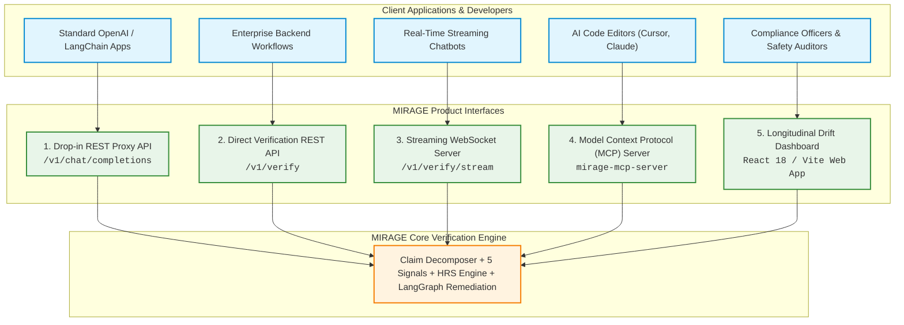
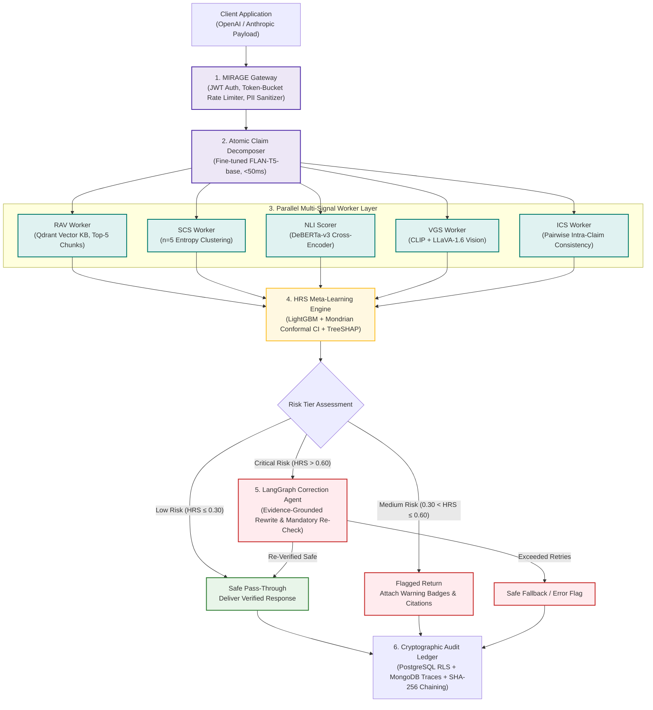
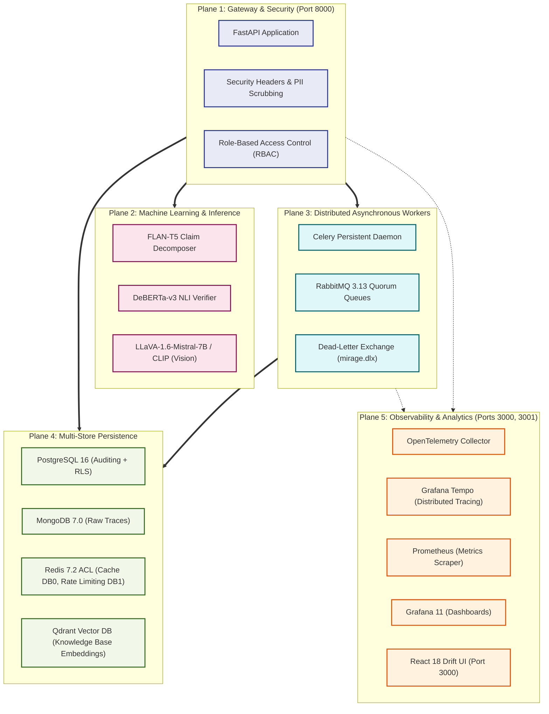

# High-Level Design (HLD): MIRAGE Verification Platform

**Institution:** Chandubhai S. Patel Institute of Technology (CSPIT)  
**Department:** Artificial Intelligence and Machine Learning  
**Investigators:** Vedant Panchal (`23AIML042`) & Dax Virani (`23AIML076`)  

---

## 1. Problem Statement & Motivation

Generative Large Language Models (LLMs) frequently generate **hallucinations**—untrue, fabricated, or internally contradictory assertions stated with uncalibrated certainty. In high-consequence domains such as healthcare, jurisprudence, and finance, undetected hallucinations cause catastrophic outcomes (e.g., lethal drug dosage recommendations, fictional judicial citations, regulatory non-compliance).

**MIRAGE** is an autonomous, multimodal, factual consistency verification and remediation middleware that intercepts LLM outputs, evaluates factual accuracy across five independent mathematical and evidentiary signals, calculates a calibrated **Hallucination Risk Score (HRS)** bounded by 95% conformal prediction intervals, and autonomously remediates corrupted claims prior to client delivery.

---

## 2. Product Classification: The 5 Product Interfaces

MIRAGE is not merely an API or a standalone application. It delivers a **five-layer hybrid product taxonomy** satisfying diverse enterprise integration patterns:

### Detailed Interface Specifications

1. **Drop-in REST Proxy API (`/v1/chat/completions`)**: Wire-compatible with the official OpenAI SDK. Enterprise clients change only their `base_url` (`https://api.mirage.internal/v1`) to gain transparent hallucination interception with zero application code changes.
2. **Direct Verification REST API (`/v1/verify`)**: Direct synchronous and asynchronous endpoints accepting a `(prompt, response, optional_image)` payload, returning atomic claims, signal breakdowns, and conformal confidence bounds.
3. **Real-Time Streaming WebSocket (`/v1/verify/stream`)**: Full-duplex WebSocket delivering progressive verification events (token chunking, atomic claim completion, signal completion) for interactive conversational agents.
4. **Model Context Protocol (MCP) Server**: A standard MCP server exposing tools (`verify_text`, `get_risk_score`, `search_knowledge_base`) to agentic development environments like Cursor, Windsurf, and Claude Desktop.
5. **Longitudinal Drift Web Dashboard**: React 18 / Vite web application visualizing tenant-level hallucination rates, SHAP feature contributions, latency percentiles, and compliance audit reports.

---

## 3. High-Level Architectural Pipeline

The verification lifecycle follows an end-to-end six-stage pipeline:

---

## 4. 5-Plane Microservices Topology

MIRAGE is deployed as a 13-container microservices stack organized across five decoupled infrastructure planes:

---

## 5. Architectural Non-Functional Requirements (NFRs)

* **Verification Latency SLA**: $P95 < 1.5\text{s}$ for cached/pure text payloads; $P95 < 3.0\text{s}$ for cold full-pipeline executions.
* **Calibrated Reliability**: Expected Calibration Error ($ECE$) $< 0.05$; conformal prediction coverage certified at $\ge 94\%$.
* **Security & Tenancy**: Cryptographic tenant isolation enforced via PostgreSQL Row-Level Security (`app.current_tenant_id`) and MongoDB tenant filtering.
* **Resilience**: Fail-closed rate limiting via Redis token bucket; graceful degradation for non-critical vector retrieval via `pybreaker`.
