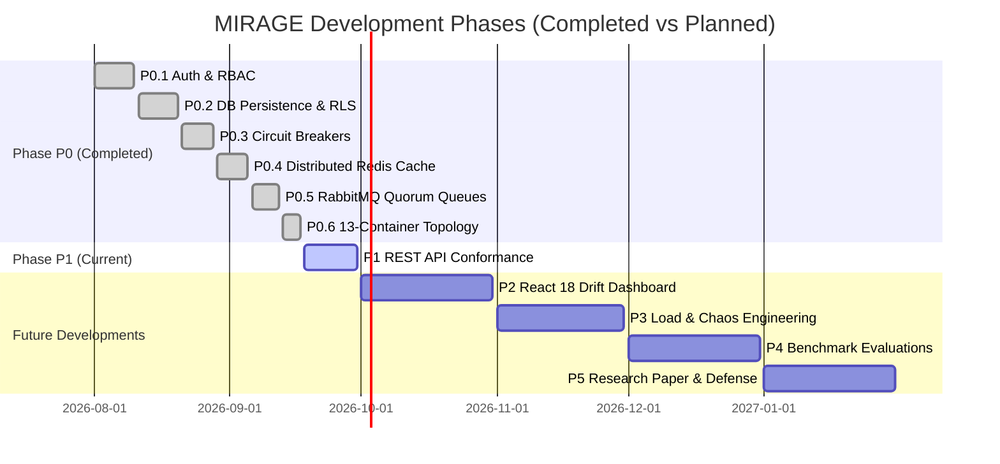

# MIRAGE: Implementation Status & Future Development Roadmap

**Institution:** Chandubhai S. Patel Institute of Technology (CSPIT)  
**Department:** Artificial Intelligence and Machine Learning  
**Investigators:** Vedant Panchal (`23AIML042`) & Dax Virani (`23AIML076`)  

---

## 1. Executive Implementation Status

As of **September 2026 (First Project Review)**, the foundational architectural phases (**Phases P0.1 through P0.6**) have been **100% completed, hardened, and verified** against the six governing engineering specifications:

$$\mathbf{307 \text{ / } 307 \text{ Automated Pytest Tests Passing}} \quad \Big(100\% \text{ Quality Gate Pass Rate}\Big)$$

---

## 2. Completed Phases & Deliverables (P0.1 – P0.6)

### Phase P0.1: Cryptographic Authentication & Role-Based Access Control (RBAC)
* **Deliverable**: Cryptographic JWT access token signing (HMAC-SHA256) and tenant API key hashing (`api_key_hash`).
* **Security Controls**: Stripped client-injected headers (`X-Role`, `X-Tenant-ID`) at ASGI boundary via `HeaderSanitizationMiddleware`.
* **Roles Enforced**: `ADMIN`, `AUDITOR`, `API_CLIENT`, `ANONYMOUS`.

### Phase P0.2: Authoritative Database Persistence & Row-Level Security
* **Deliverable**: PostgreSQL 16 relational storage for sessions and claims; MongoDB 7.0 for unstructured traces.
* **Security Controls**: PostgreSQL Row-Level Security (`ALTER TABLE verification_sessions ENABLE ROW LEVEL SECURITY`) with unprivileged application user `mirage_app`.
* **Auditability**: SHA-256 cryptographic chain hashing linking successive verification runs.

### Phase P0.3: Circuit Breaker Failure Semantics & Resilience
* **Deliverable**: Implemented `pybreaker` state machines across all external dependencies:
  * LLM API: `fail_max=5`, `reset_timeout=60s`
  * Qdrant: `fail_max=3`, `reset_timeout=30s` (Graceful fallback to RAV-less mode)
  * Redis: `fail_max=5`, `reset_timeout=10s` (Fail-closed rate limiting, 503 Retry-After)
  * RabbitMQ: `fail_max=2`, `reset_timeout=120s`

### Phase P0.4: Distributed Cache & State Decoupling
* **Deliverable**: Eliminated in-memory caching in production paths.
* **Architecture**: Redis 7.2 with Access Control Lists (ACL):
  * **DB0**: Key-level read/write for SCS entropy cache (`scs:{hash}`).
  * **DB1**: Token-Bucket distributed rate limiter tracking per-tenant request quotas.

### Phase P0.5: RabbitMQ Broker Durability, Quorum Queues & Worker Daemons
* **Deliverable**: RabbitMQ 3.13 Quorum queues (`x-queue-type: quorum`) with Raft consensus.
* **Fault Handling**: Celery dead-letter routing to `mirage.dlq` on poison message frames.
* **Worker Lifecycle**: Upgraded Celery worker into a persistent daemon handling asynchronous verification tasks.

### Phase P0.6: 13-Container Docker Compose Multi-Container Production Hardening
* **Deliverable**: Hardened multi-container topology orchestrating all 13 services.
* **Security Hardening**: Dropped container Linux capabilities (`cap_drop: ALL`), enforced non-root users (`no-new-privileges: true`), read-only root filesystems, and unexposed stateful database ports.
* **Observability**: Added OpenTelemetry Collector routing OTLP traces to Grafana Tempo and Prometheus.

---

## 3. Current In-Progress Phase: Phase P1

### Phase P1: Missing REST API Endpoints & Contract Conformance
Currently in active planning and development:
* Implementing missing governing endpoints:
  * `/v1/sessions/{id}`: Detailed session inspection with claim breakdowns.
  * `/v1/alerts`: Tenant threshold breach notifications.
  * `/v1/reports/generate` & `/v1/reports/{id}/pdf`: Automated compliance PDF generation.
  * `/v1/knowledge-base/upload`: Multipart file upload with automated chunking and embedding into Qdrant.
* Resolving ADR 0005: Aligning alert thresholds, report deduplication windows, and knowledge base replacement policies.

---

## 4. Remaining Implementation & Future Developments

### Phase P2: React 18 Longitudinal Drift Dashboard & Live Streaming UI (October 2026)
* **React 18 + Vite Web App**: Dedicated frontend for compliance officers and AI safety engineers.
* **Visualizations**:
  * **Interactive TreeSHAP Waterfall Plots**: Live visual breakdown of which signals contributed to flagging each claim.
  * **Longitudinal Hallucination Trends**: Temporal drift charts tracking model hallucination rates over days/weeks.
  * **Tenant Quota & Billing Monitor**: Real-time token consumption and rate limit statuses.
* **WebSocket Client**: Live token-by-token streaming verification visualizer.

### Phase P3: Load Testing & Chaos Resilience Engineering (November 2026)
* **k6 Distributed Load Testing**: Validating throughput under $100$ concurrent user threads with $P95 < 3.0\text{s}$ SLA compliance.
* **Toxiproxy Fault Injection**: Inducing artificial network latency (jitter, packet loss, socket resets) on Redis, Qdrant, and RabbitMQ to mathematically prove zero unhandled 500 crashes.

### Phase P4: Comprehensive Benchmark Evaluation (December 2026)
* Rigorous empirical evaluation across four established hallucination benchmarks:
  1. **TruthfulQA**: Measuring factual accuracy on adversarial falsehoods.
  2. **HaluEval**: Evaluating general text generation and dialogue hallucination detection.
  3. **MMHAL-Bench**: Evaluating multimodal vision-language hallucinations (CLIP + LLaVA).
  4. **FActScore**: Assessing atomic biographical claim verification accuracy.
* Evaluating target metrics: Expected Calibration Error ($ECE < 0.05$), Conformal Coverage ($\ge 94\%$), and Verification F1-Score ($> 0.88$).

### Phase P5: Research Paper Submission & Final Project Defense (January 2027)
* Drafting research paper: *"MIRAGE: Calibrated Multi-Signal Verification and Autonomous Remediation Middleware for Production LLMs"*.
* Target submission: High-impact AI Safety / NLP workshop or conference.
* Final presentation, code audit, and engineering defense.

---

## 5. Comprehensive 6-Month Roadmap Summary

| Milestone | Target Schedule | Key Deliverables & Verification Artifacts | Status |
| :--- | :--- | :--- | :--- |
| **Phase P0 (0.1–0.6)** | August–Sept 2026 | JWT/API Auth, Postgres RLS, Mongo Dual-Write, Redis Token-Bucket, RabbitMQ Quorum Queues, 13-Container Docker Stack. | **COMPLETED (307/307 Tests)** |
| **Phase P1** | September 2026 | Full REST API Conformance (`/v1/sessions/{id}`, `/v1/alerts`, `/v1/reports`, `/v1/kb/upload`). | **IN PROGRESS** |
| **Phase P2** | October 2026 | React 18 Drift Dashboard, interactive SHAP waterfall views, WebSocket streaming UI. | **PLANNED** |
| **Phase P3** | November 2026 | k6 load testing (100 users, $P95 < 3$s) and Toxiproxy chaos resilience validation. | **PLANNED** |
| **Phase P4** | December 2026 | Benchmark evaluations on TruthfulQA, HaluEval, MMHAL-Bench, and FActScore. | **PLANNED** |
| **Phase P5** | January 2027 | Research paper draft submission and final capstone project defense. | **PLANNED** |
