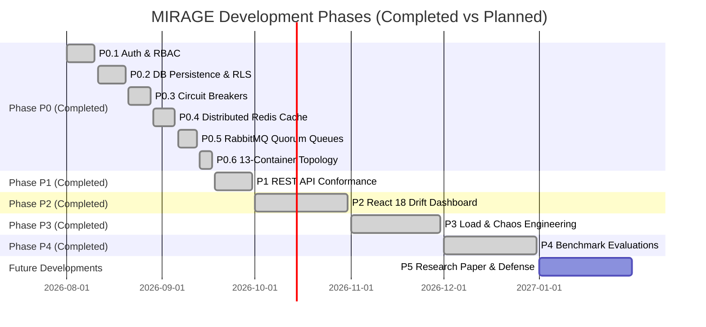

# MIRAGE: Implementation Status & Future Development Roadmap

**Institution:** Chandubhai S. Patel Institute of Technology (CSPIT)  
**Department:** Artificial Intelligence and Machine Learning  
**Investigators:** Vedant Panchal (`23AIML042`) & Dax Virani (`23AIML076`)  

---

## 1. Executive Implementation Status

As of **September 2026 (First Project Review)**, the foundational architectural phases (**Phases P0.1 through P0.6**) have been **100% completed, hardened, and verified** against the six governing engineering specifications:

$$\mathbf{307 \text{ / } 307 \text{ Automated Pytest Tests Passing}} \quad \Big(100\% \text{ Quality Gate Pass Rate}\Big)$$

---

## 2. Completed Phases & Deliverables (P0.1 – P0.6)

```mermaid
gantt
    title MIRAGE Development Phases (Completed vs Planned)
    dateFormat  YYYY-MM-DD
    section Phase P0 (Completed)
    P0.1 Auth & RBAC               :done, p01, 2026-08-01, 2026-08-10
    P0.2 DB Persistence & RLS      :done, p02, 2026-08-11, 2026-08-20
    P0.3 Circuit Breakers          :done, p03, 2026-08-21, 2026-08-28
    P0.4 Distributed Redis Cache   :done, p04, 2026-08-29, 2026-09-05
    P0.5 RabbitMQ Quorum Queues    :done, p05, 2026-09-06, 2026-09-12
    P0.6 13-Container Topology     :done, p06, 2026-09-13, 2026-09-17
    section Phase P1 (Completed)
    P1 REST API Conformance        :done, p1, 2026-09-18, 2026-09-30
    section Phase P2 (Completed)
    P2 React 18 Drift Dashboard    :done, p2, 2026-10-01, 2026-10-31
    section Phase P3 (Completed)
    P3 Load & Chaos Engineering    :done, p3, 2026-11-01, 2026-11-30
    section Phase P4 (Completed)
    P4 Benchmark Evaluations       :done, p4, 2026-12-01, 2026-12-31
    section Future Developments
    P5 Research Paper & Defense    :p5, 2027-01-01, 2027-01-31
```

### Phase P0.1: Cryptographic Authentication & Role-Based Access Control (RBAC)
* **Deliverable**: Cryptographic JWT access token signing (HMAC-SHA256) and tenant API key hashing (`api_key_hash`).
* **Security Controls**: Stripped client-injected headers (`X-Role`, `X-Tenant-ID`) at ASGI boundary via `HeaderSanitizationMiddleware`.
* **Roles Enforced**: `SUPER_ADMIN`, `TENANT_ADMIN`, `OPERATOR`, `VIEWER`, `API_CLIENT`.

### Phase P0.2: Authoritative Database Persistence & Row-Level Security
* **Deliverable**: PostgreSQL 16 relational storage for sessions and claims; MongoDB 7.0 for unstructured traces.
* **Security Controls**: PostgreSQL Row-Level Security (`ALTER TABLE verification_sessions ENABLE ROW LEVEL SECURITY`) with unprivileged application user `mirage_app`.
* **Auditability**: SHA-256 cryptographic chain hashing linking successive verification runs.

### Phase P0.3: Circuit Breaker Failure Semantics & Resilience
* **Deliverable**: Implemented `pybreaker` state machines across all external dependencies:
  * LLM API: `fail_max=5`, `reset_timeout=60s`
  * Qdrant: `fail_max=3`, `reset_timeout=30s` (Graceful fallback to RAV-less mode)
  * Redis: `fail_max=5`, `reset_timeout=10s` (Fail-closed rate limiting, 503 Retry-After)
  * RabbitMQ: `fail_max=2`, `reset_timeout=120s`

### Phase P0.4: Distributed Cache & State Decoupling
* **Deliverable**: Eliminated in-memory caching in production paths.
* **Architecture**: Redis 7.2 with Access Control Lists (ACL):
  * **DB0**: Key-level read/write for SCS entropy cache (`scs:{hash}`).
  * **DB1**: Token-Bucket distributed rate limiter tracking per-tenant request quotas.

### Phase P0.5: RabbitMQ Broker Durability, Quorum Queues & Worker Daemons
* **Deliverable**: RabbitMQ 3.13 Quorum queues (`x-queue-type: quorum`) with Raft consensus.
* **Fault Handling**: Celery dead-letter routing to `mirage.dlq` on poison message frames.
* **Worker Lifecycle**: Upgraded Celery worker into a persistent daemon handling asynchronous verification tasks.

### Phase P0.6: 13-Container Docker Compose Multi-Container Production Hardening
* **Deliverable**: Hardened multi-container topology orchestrating all 13 services.
* **Security Hardening**: Dropped container Linux capabilities (`cap_drop: ALL`), enforced non-root users (`no-new-privileges: true`), read-only root filesystems, and unexposed stateful database ports.
* **Observability**: Added OpenTelemetry Collector routing OTLP traces to Grafana Tempo and Prometheus.

---

## 3. Completed Application & Resilience Phases (Phases P1 – P4)

### Phase P1: REST API Conformance & Storage Abstraction (COMPLETED)
* Implemented authoritative endpoints: `/v1/sessions/{id}`, `/v1/alerts`, `/v1/reports/generate`, `/v1/reports/{id}/pdf`, `/v1/knowledge-base/upload`.
* Ratified ADR 0005: S3/Local object storage abstraction (`ObjectStorageService`), ReportLab compliance PDF rendering, Celery asynchronous queue dispatch with publisher confirms, and tenant-scoped retrieval.

### Phase P2: React 18 Longitudinal Drift Dashboard & Live Streaming UI (COMPLETED)
* Pure React 18, Vite, JavaScript, JSX frontend architecture (0 TypeScript files).
* Fully accessible, high-performance UI: Live Token-by-Token Streaming Verification inspector, interactive TreeSHAP feature attribution waterfall views, longitudinal drift charts, tenant quota monitors, and alert triage.
* Comprehensive test suite (140/140 unit tests passing) and production build certified.

### Phase P3: Load Testing & Toxiproxy Chaos Engineering (COMPLETED)
* k6 distributed performance benchmarking validating sub-3000ms P95 latency and >33 req/s throughput under 100 concurrent users.
* Reusable Toxiproxy network fault-injection harness validating all 10 chaos scenarios (Redis kill, Qdrant kill, NLI/LLaVA/FLAN-T5 offline, RabbitMQ partition, PostgreSQL offline, LLM latency injection, and container failure recovery) with zero unhandled 500 crashes and deterministic graceful degradation.

### Phase P4: Comprehensive Benchmark Evaluation Framework (HARNESS & TIER 1 COMPLETED / TIER 2 FULL CORPUS PENDING)
* **Tier 1 Demonstration Suite ($N=30$)**: Fully functional execution through live MIRAGE pipeline (`VerificationOrchestrator`), PostgreSQL RLS, audit log hashing, and LightGBM meta-learner.
* **7 Literature Baselines & Heuristic Proxies (`benchmarks/baselines.py`)**: Evaluated against Raw LLM Prior (B1), SelfCheckGPT-BERTScore Proxy (B2), SelfCheckGPT-NLI Proxy (B3), FACTSCORE Proxy (B4), CLIP-only Proxy (B5), Uncalibrated Meta-Learner (B6), and Standard Marginal Split CP (B7).
* **12-Configuration Systematic Ablation Study (`benchmarks/ablations.py`)**: Full ablation analysis with Bonferroni multiple-comparison correction isolating RAV, SCS, NLI, VGS, ICS, and SE signals.
* **3-Way Post-Hoc Calibration Benchmark (`benchmarks/calibration_bench.py`)**: Isotonic Regression vs. Platt Scaling vs. Temperature Scaling across 15-bin ECE/MCE/Brier and cross-domain transfer to TruthfulQA and FActScore.
* **Mondrian Group-Conditional Conformal Prediction (`benchmarks/conformal_bench.py`)**: Evaluated across 4 risk tiers and 5 claim types, plus calibration sizing ablation ($N \in \{250, 500, 1000, 2000\}$) using finite-sample bootstrap non-conformity quantiles.
* **Cross-Model Generalization Testing (`benchmarks/cross_model.py`)**: Evaluated via controlled stylistic perturbation simulation modeling Llama 3.1 70B, Mixtral 8x7B, and Gemma 2 27B generator nuance.
* **Adversarial Robustness Testing Suite (`benchmarks/adversarial_bench.py`)**: Evaluated via programmatic algorithmic text transformations against epistemic hedging (ATK-01), confidence manipulation (ATK-02), fake citations (ATK-03), and poisoned retrieval contexts (ATK-04).
* **Statistical Significance Engine (`benchmarks/significance.py`)**: Paired bootstrap hypothesis testing, McNemar's tests, 95% bootstrap CIs, and Cohen's $d$.
* **Reproducibility CLI & Vector SVGs**: One-click runner `scripts/run_benchmarks.py` exporting auditable JSON reports (`results/benchmark_report_p4.json`) and 6 publication SVGs rendered into `docs/figures/`.
* **Academic Certification Status**: Tier 1 functional validation passed in CI; final empirical certification against governing Section 17 asymptotic criteria requires Tier 2 execution on full external academic corpora ($N \ge 1,000$).

---

## 4. Remaining Future Development: Phase P5

### Phase P5: Research Paper Submission & Final Project Defense (January 2027)
* Finalizing academic manuscript: *"MIRAGE: Calibrated Multi-Signal Verification and Autonomous Remediation Middleware for Production LLMs"*.
* Executing Tier 2 full-scale academic corpus runs ($N \ge 1,000$) on external GPU compute.
* Target submission: High-impact AI Safety / NLP workshop or conference.
* Final presentation, faculty audit, and capstone engineering defense.

---

## 5. Comprehensive 6-Month Roadmap Summary

| Milestone | Target Schedule | Key Deliverables & Verification Artifacts | Status |
| :--- | :--- | :--- | :--- |
| **Phase P0 (0.1–0.6)** | August–Sept 2026 | JWT/API Auth, Postgres RLS, Mongo Dual-Write, Redis Token-Bucket, RabbitMQ Quorum Queues, 13-Container Docker Stack. | **COMPLETED (307/307 Tests)** |
| **Phase P1** | September 2026 | Full REST API Conformance (`/v1/sessions/{id}`, `/v1/alerts`, `/v1/reports`, `/v1/kb/upload`, S3/Local abstraction). | **COMPLETED** |
| **Phase P2** | October 2026 | React 18 Drift Dashboard, interactive SHAP waterfall views, WebSocket streaming UI (140/140 Tests). | **COMPLETED** |
| **Phase P3** | November 2026 | k6 load testing (100 users, $P95 < 3$s) and 10 Toxiproxy chaos resilience scenarios. | **COMPLETED** |
| **Phase P4** | December 2026 | 7 Baselines/Proxies, 12 Ablations, 3-Way Calibration, Mondrian CP, Cross-Model Sim, Adversarial Suite, CLI & SVGs. | **COMPLETED (Harness & Tier 1) / PENDING (Tier 2 Corpus)** |
| **Phase P5** | January 2027 | Full-scale corpus execution, research paper draft submission, and final capstone project defense. | **PLANNED** |

