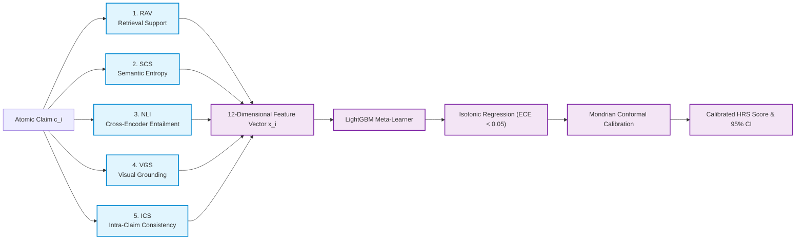
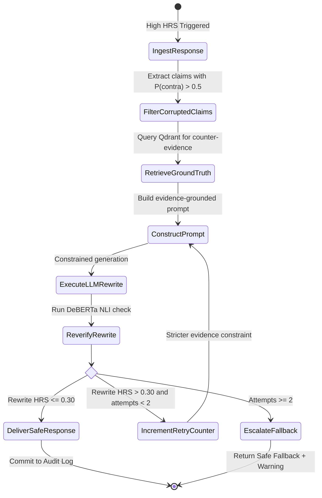
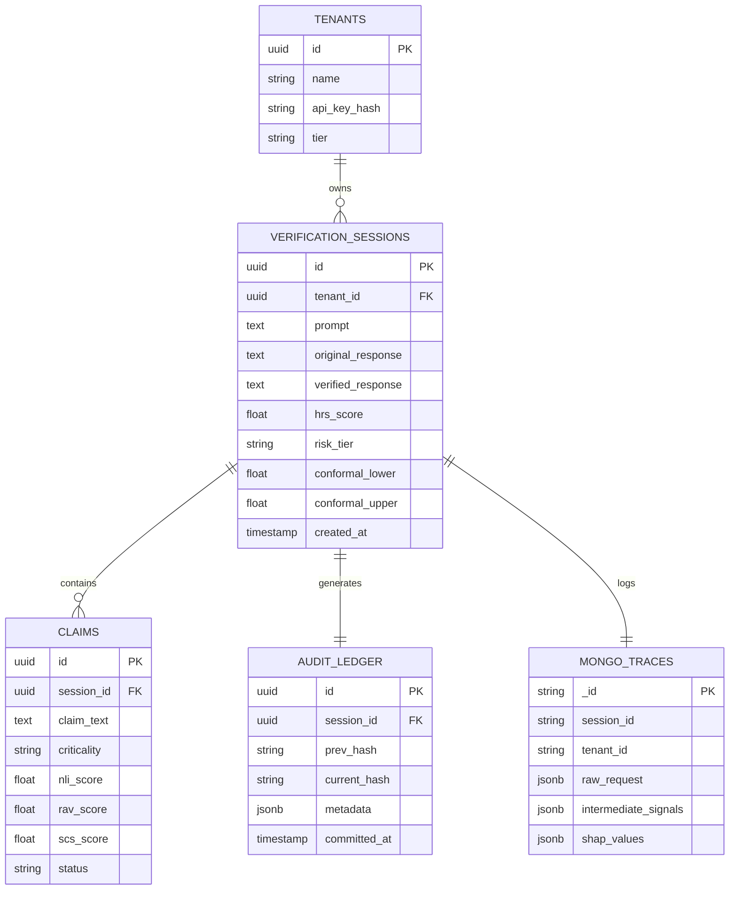

# Low-Level Design (LLD): MIRAGE Verification Platform

**Institution:** Chandubhai S. Patel Institute of Technology (CSPIT)  
**Department:** Artificial Intelligence and Machine Learning  
**Investigators:** Vedant Panchal (`23AIML042`) & Dax Virani (`23AIML076`)  

---

## 1. Atomic Claim Decomposition Module (`FLAN-T5-base`)

Compound sentences generated by LLMs cannot be verified as monolithic text because a single paragraph often combines true facts with subtle falsehoods.

### Algorithm & Pipeline
1. **Model**: Fine-tuned `google/flan-t5-base` on claim decomposition benchmarks (FACTSCORE, MiniCheck).
2. **Execution Profile**: Runs locally on CPU in $<50$ms per generation.
3. **Criticality Classification**:
   * **High ($w_i = 1.0$)**: Numerical quantities, clinical dosages, named individuals, dates, legal case citations, financial figures.
   * **Medium ($w_i = 0.6$)**: Relational assertions, causal statements, geographic locations.
   * **Low ($w_i = 0.3$)**: Conversational transitions, stylistic fillers, subjective commentary.

```json
{
  "claim_id": "c_9b81a2",
  "text": "Apollo 11 was launched on July 16, 1969.",
  "criticality": "HIGH",
  "criticality_weight": 1.0,
  "span_start": 0,
  "span_end": 40
}
```

---

## 2. Multi-Signal Mathematical Formulations



### Signal 1: Retrieval-Augmented Verification (RAV)
* **Embedding Model**: `sentence-transformers/all-mpnet-base-v2` ($768$ dimensions).
* **Storage Engine**: Qdrant Vector Store with HNSW indexing ($M=16, ef\_construct=100$).
* **Retrieval Metric**: Cosine similarity against top-$k$ evidence chunks ($k=5$):
  $$RSS(c_i) = \max_{e_j \in \mathcal{E}} \frac{\mathbf{e}_{c_i} \cdot \mathbf{e}_{e_j}}{\|\mathbf{e}_{c_i}\| \|\mathbf{e}_{e_j}\|}$$

### Signal 2: Self-Consistency Sampling (SCS) & Semantic Entropy
* Samples primary model completions $n=5$ at temperature $T=0.7$.
* Groups completions into discrete equivalence classes $\mathcal{C} = \{C_1, C_2, \dots, C_m\}$ where completions $y_a, y_b \in C_k$ if bidirectional entailment holds:
  $$\text{NLI}(y_a \to y_b) = \text{Entailed} \quad \land \quad \text{NLI}(y_b \to y_a) = \text{Entailed}$$
* Computes normalized discrete Semantic Entropy:
  $$SE = -\frac{1}{\log_2 N} \sum_{k=1}^m P(C_k) \log_2 P(C_k)$$

### Signal 3: Natural Language Inference (NLI)
* **Model**: Fine-tuned `microsoft/deberta-v3-large` deployed on TorchServe.
* For each pair $(e_j, c_i)$ where $e_j$ is retrieved evidence, outputs 3-class softmax:
  $$\mathbf{p}_{\text{NLI}} = \text{Softmax}\big(\mathbf{z}_{\text{entail}}, \mathbf{z}_{\text{neutral}}, \mathbf{z}_{\text{contra}}\big)$$

### Signal 4: Visual Grounding Score (VGS)
* For multimodal queries with image $I$, runs CLIP ViT-B/32 similarity pre-filtering:
  * If $\text{sim}_{\text{CLIP}}(I, c_i) > 0.85$, bypass deep visual inference ($0$ms overhead).
  * If $\text{sim}_{\text{CLIP}}(I, c_i) \le 0.85$, query LLaVA-1.6-Mistral-7B via Text-Generation-Inference (TGI) with targeted visual question answering.

### Signal 5: Internal Consistency Scorer (ICS)
* Evaluates all intra-response claim pairs $O(K^2)$ using DeBERTa to detect logical paradoxes within the *same* generation:
  $$ICS = \max_{j \ne i} P_{\text{contra}}(c_i, c_j)$$

---

## 3. Calibrated Risk Engine (HRS) Formulation

For each claim $c_i$, the 12-dimensional signal vector is constructed:
$$\mathbf{x}_i = \Big[RSS(c_i), \overline{RSS}_k, SE, P_{\text{entail}}, P_{\text{neutral}}, P_{\text{contra}}, ICS, VGS, \text{sim}_{\text{CLIP}}, w_i, \text{len}(c_i), \text{pos}(c_i)\Big]$$

### Meta-Learning & Calibration
1. **Raw Scoring**: $\widehat{y}_i = \text{LightGBM}(\mathbf{x}_i) \in [0, 1]$.
2. **Calibration**: Isotonic regression mapping ensures statistical reliability:
   $$\min_m \sum_{i=1}^N \Big(y_i - m(\widehat{y}_i)\Big)^2 \quad \text{subject to } m(a) \le m(b) \text{ for } a \le b$$
3. **Mondrian Conformal Prediction**: Bounded 95% confidence intervals $[HRS_{\text{lower}}, HRS_{\text{upper}}]$ conditioned on claim criticality group $g \in \{\text{High}, \text{Medium}, \text{Low}\}$.

---

## 4. Autonomous Remediation State Machine (LangGraph)

When $HRS > 0.60$, the LangGraph state machine takes control to isolate and remediate corrupted claims:



---

## 5. Multi-Store Persistence & Schema Design



### Key Security & Database Policies
1. **PostgreSQL Row-Level Security (RLS)**: Enforced via `ALTER TABLE verification_sessions ENABLE ROW LEVEL SECURITY;`. Application sessions execute `SET LOCAL app.current_tenant_id = 'tenant_123'` before any queries.
2. **MongoDB Tenant Isolation**: Indexed compound shard keys `{ tenant_id: 1, created_at: -1 }`.
3. **Redis 7.2 ACL Partitioning**:
   * **DB0**: Cache user (`mirage_cache`) with read/write access to `scs:*` keys only.
   * **DB1**: Rate limit user (`mirage_ratelimit`) with access to `ratelimit:*` keys.
4. **RabbitMQ 3.13 Quorum Queues**: `x-queue-type: quorum` with Raft consensus replication and dead-letter routing to `mirage.dlq`.
