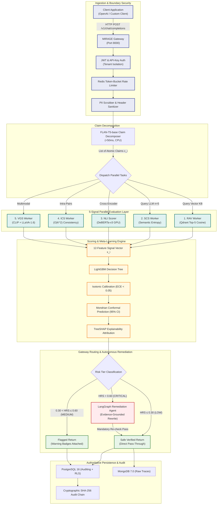
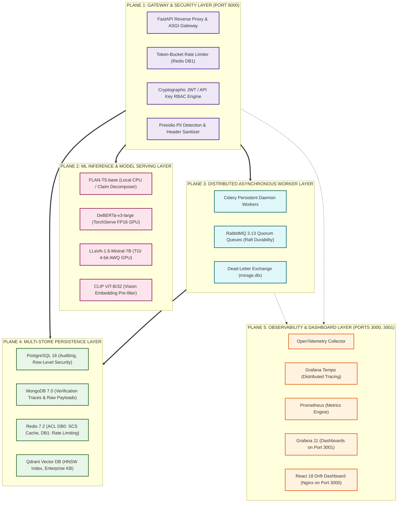
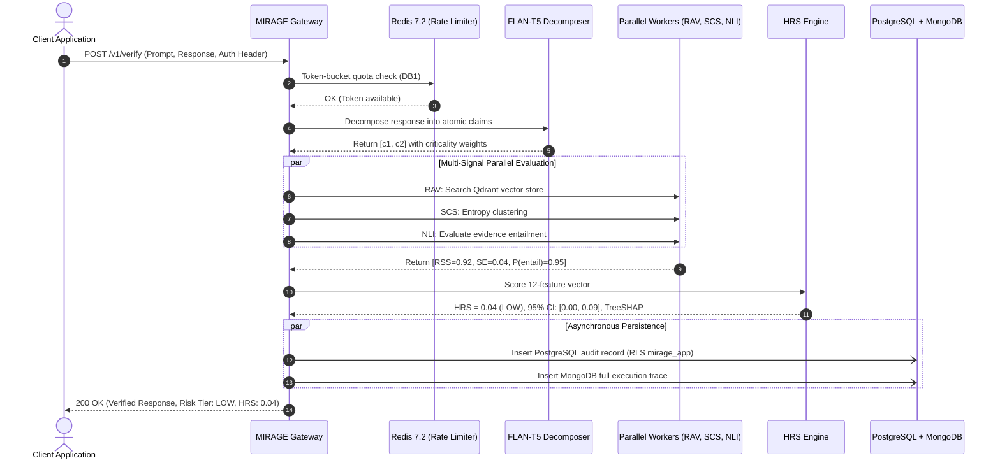
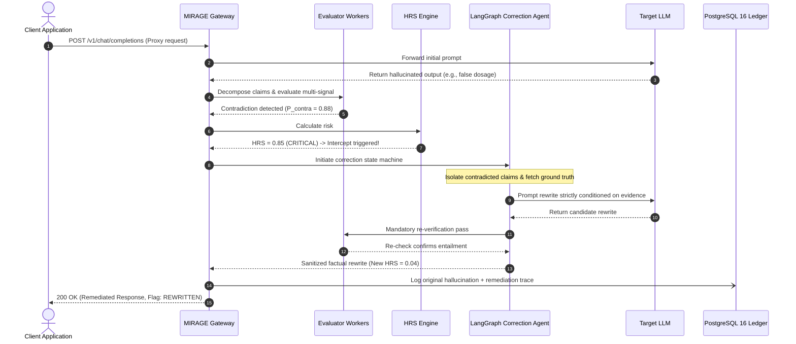
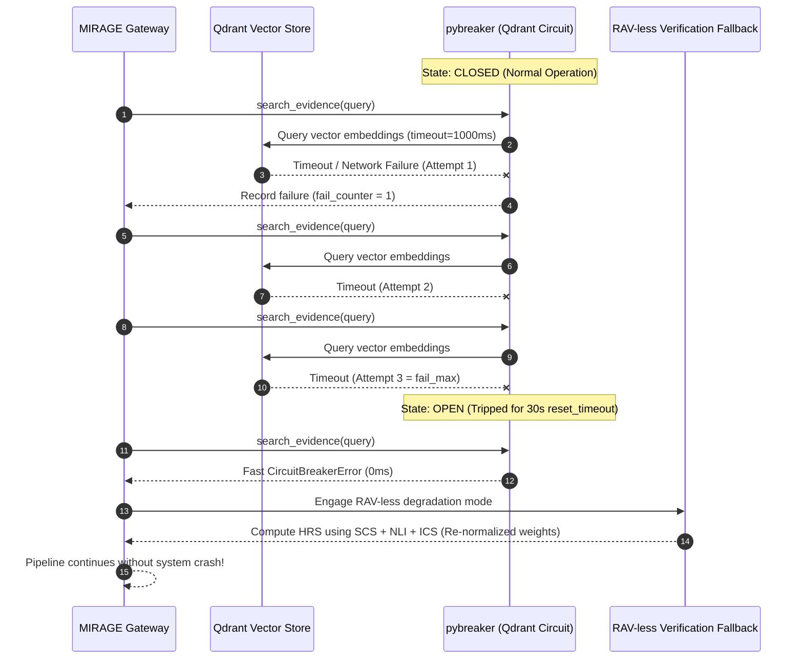
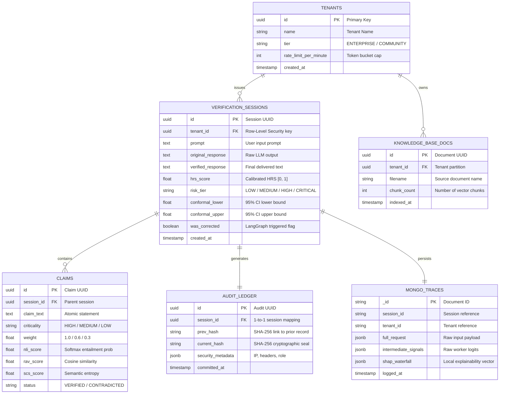

# MIRAGE: System Architecture & Visual Diagram Catalog

**Institution:** Chandubhai S. Patel Institute of Technology (CSPIT)  
**Department:** Artificial Intelligence and Machine Learning  
**Investigators:** Vedant Panchal (`23AIML042`) & Dax Virani (`23AIML076`)  

This catalog contains all core system architecture diagrams rendered in standard GitHub-compatible Mermaid format for faculty review and presentation slides.

---

## Diagram 1: End-to-End High-Level Execution Pipeline

---

## Diagram 2: 5-Plane Production Microservices Topology

---

## Diagram 3: Happy Path Execution Sequence (Low Risk Pass-Through)

---

## Diagram 4: Remediation Loop Sequence (High Risk Intercept)

---

## Diagram 5: Circuit Breaker Failure & Fallback Sequence

---

## Diagram 6: Database Entity-Relationship & Multi-Store Architecture

